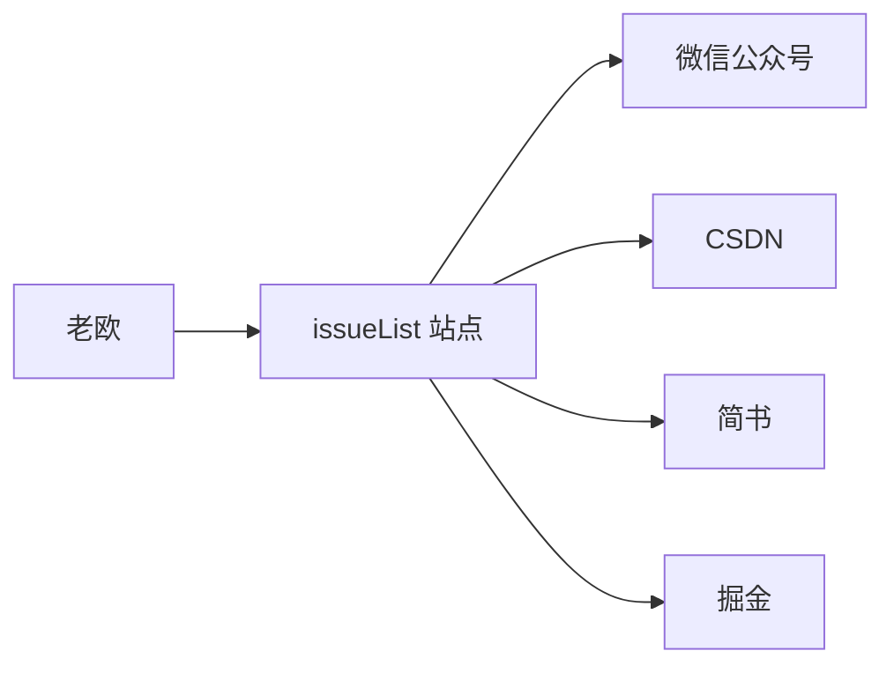
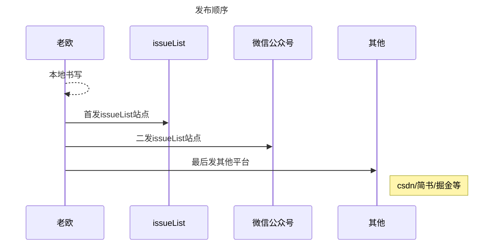
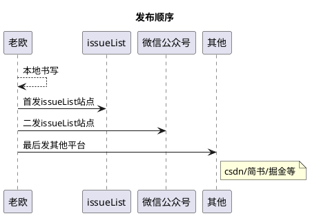

# 老欧的 issueList :id=issuelist

<!-- panels:start -->
<!-- div:left-panel -->
#### 干嘛的
老欧用来对工作经验和实验学习过的一些项目等做一些经验积累与知识沉淀的地方。  

原本已 issue 的形式记录在 [github 仓库](https://github.com/bruceouyang/issueList/issues) 里边，经过`俄乌事件`后，感觉很有必要将内容拉出来，万一哪天被搞了呢~

我会把后续更新的内容优先在此站点发布，其他站点同步更新。

#### 内容推送

老欧的文章首发在[老欧的 issueList站点](https://bruce.bugmakers.club)，陆续同步更新到[CSDN](https://blog.csdn.net/boybruce)、[简书](https://www.jianshu.com/u/8bc5f4428ca2)、[掘金](https://juejin.cn/user/2506542242595927)和[微信公众号](https://bruce.bugmakers.club/assets/wechat-subscribe-qr.jpg)等平台。  

<!-- tabs:start -->
<!-- tab:发布顺序 -->


<!-- tab:mermaid -->



<!-- tab:websequencediagrams -->
```websequencediagrams
title 发布顺序
老欧 --> 老欧: 本地书写
老欧 -> issueList: 首发issueList站点
老欧 -> 微信公众号: 二发issueList站点
老欧 -> 其他: 最后发其他平台
note right of 其他: csdn/简书/掘金等
```

<!-- tab:plantuml -->

<!-- tabs:end -->

<!-- div:right-panel -->

#### 而立 & 不惑
* 做一个成年人
  - 有能力安排好自己的时间。
  - 不会只是抱怨问题，会自己去解决问题。
  - 懂得纪律和规则的重要性。
  - 面对一个巨大的难度，能够和一群合适的同事一起解决它，成功是最好的激励。
> 出自《奈非文化手册》和《不拘一格：网飞的自由与责任工作法》

* 做一个执行力强的人
  - 执行前：有目标、有规划、有方向。
  - 执行中：有反馈、有节奏、有坚持。
  - 执行完：有结果、有思考、有沉淀。

* 做一个终身学习的人
  - 要有方向，向上的方向，不甘人后。
  - 要有见识，独立思考和判断的能力。
  - 要坚持，行百里者半九十。
<!-- panels:end -->


<!-- chat:start -->

#### **霸葛**

老欧，牛逼

#### **女神**

老欧，可以哦

#### **龙炸**

老欧，有点东西

#### **老欧**

:smile: 哈哈哈

<!-- chat:end -->