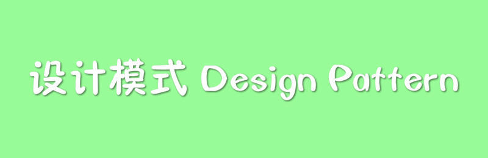
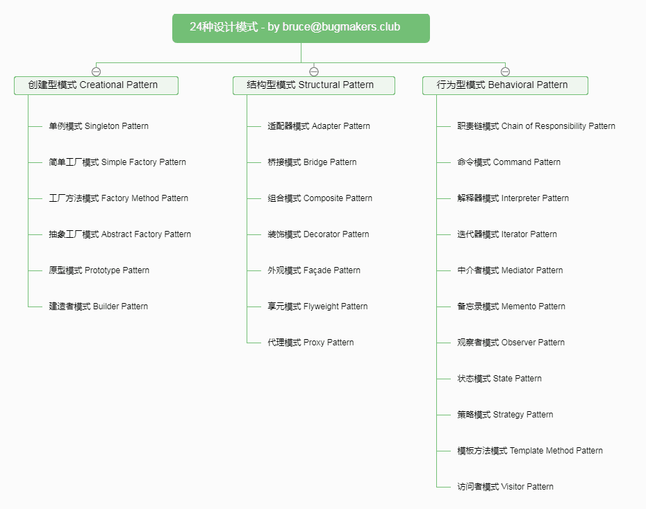

> Bruce Ouyang 正在学习[**《设计模式Java版》**](https://gof.quanke.name/)  这本书  
> 主要内容以及对应源码记录在[BruceOuyang/boy-design-pattern](https://github.com/BruceOuyang/boy-design-pattern)仓库

## 初衷
1. 系统的学习一遍设计模式  

2. 习惯了markdown阅读，出处 gitbook 已停服

> [quanke大神的csdn博客](http://blog.csdn.net/lovelion) 这里还能正常访问，习惯csdn风格的可以访问这个地址。

3. 融入一点自己的风格：我将刘伟大神的设计模式一书内容分散在代码的各个包里边，方便阅读  

4. 原文中有一些练习，就在这个仓库的源码中做掉

## 二十四种设计模式一览

## 总览

* **创建型**
  * [SEQ1-简单工厂模式](/blog/design-pattern/type1/SEQ1-简单工厂模式.md)
  * [SEQ2-工厂方法模式](/blog/design-pattern/type1/SEQ2-工厂方法模式.md)
  * [SEQ3-抽象工厂模式](/blog/design-pattern/type1/SEQ3-抽象工厂模式.md)
  * [SEQ4-单例模式](/blog/design-pattern/type1/SEQ4-单例模式.md)
  * [SEQ5-原型模式](/blog/design-pattern/type1/SEQ5-原型模式.md)
  * [SEQ6-建造者模式](/blog/design-pattern/type1/SEQ6-建造者模式.md)
* **结构型**
  * [SEQ1-适配器模式](/blog/design-pattern/type2/SEQ1-适配器模式.md)
  * [SEQ2-桥接模式](/blog/design-pattern/type2/SEQ2-桥接模式.md)
  * [SEQ3-组合模式](/blog/design-pattern/type2/SEQ3-组合模式.md)
  * [SEQ4-装饰模式](/blog/design-pattern/type2/SEQ4-装饰模式.md)
  * [SEQ5-外观模式](/blog/design-pattern/type2/SEQ5-外观模式.md)
  * [SEQ6-享元模式](/blog/design-pattern/type2/SEQ6-享元模式.md)
  * [SEQ7-代理模式](/blog/design-pattern/type2/SEQ7-代理模式.md)
* **行为型**
  * [SEQ01-职责链模式](/blog/design-pattern/type3/SEQ01-职责链模式.md)
  * [SEQ02-命令模式](/blog/design-pattern/type3/SEQ02-命令模式.md)
  * [SEQ03-解释器模式](/blog/design-pattern/type3/SEQ03-解释器模式.md)
  * [SEQ04-迭代器模式](/blog/design-pattern/type3/SEQ04-迭代器模式.md)
  * [SEQ05-中介者模式](/blog/design-pattern/type3/SEQ05-中介者模式.md)
  * [SEQ06-备忘录模式](/blog/design-pattern/type3/SEQ06-备忘录模式.md)
  * [SEQ07-观察者模式](/blog/design-pattern/type3/SEQ07-观察者模式.md)
  * [SEQ08-状态模式](/blog/design-pattern/type3/SEQ08-状态模式.md)
  * [SEQ09-策略模式](/blog/design-pattern/type3/SEQ09-策略模式.md)
  * [SEQ10-模板方法模式](/blog/design-pattern/type3/SEQ10-模板方法模式.md)
  * [SEQ11-访问者模式](/blog/design-pattern/type3/SEQ11-访问者模式.md)
* [**趣味学习-设计模式与足球**](/blog/design-pattern/趣味学习-设计模式与足球.md)