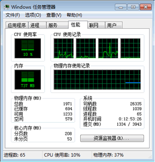
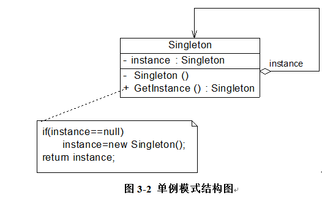
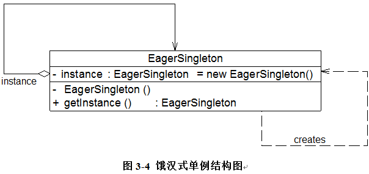
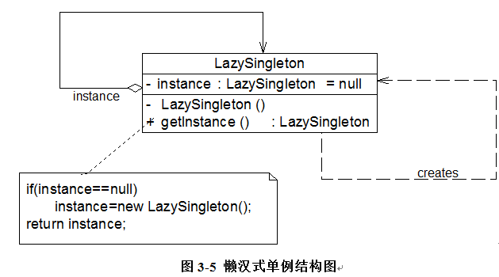

>【学习难度：★☆☆☆☆，使用频率：★★★★☆】   
>  直接出处：[单例模式](http://woquanke.com/books/gof/%E5%8D%95%E4%BE%8B%E6%A8%A1%E5%BC%8F-Singleton%20Pattern.html)  
>  梳理和学习：https://github.com/BruceOuyang/boy-design-pattern  
>  简书日期： 2018/03/06  
>  简书首页：https://www.jianshu.com/p/0fb891a7c5ed  

## 确保对象的唯一性——单例模式 （一）

3.1 单例模式的动机  

对于一个软件系统的某些类而言，我们无须创建多个实例。举个大家都熟知的例子——Windows任务管理器，如图3-1所示，我们可以做一个这样的尝试，在Windows的“任务栏”的右键弹出菜单上多次点击“启动任务管理器”，看能否打开多个任务管理器窗口？如果你的桌面出现多个任务管理器，我请你吃饭，微笑（注：电脑中毒或私自修改Windows内核者除外）。

通常情况下，无论我们启动任务管理多少次，Windows系统始终只能弹出一个任务管理器窗口，也就是说在一个Windows系统中，任务管理器存在唯一性。

为什么要这样设计呢？我们可以从以下两个方面来分析：

* 其一，如果能弹出多个窗口，且这些窗口的内容完全一致，全部是重复对象，这势必会浪费系统资源，任务管理器需要获取系统运行时的诸多信息，这些信息的获取需要消耗一定的系统资源，包括CPU资源及内存资源等，浪费是可耻的，而且根本没有必要显示多个内容完全相同的窗口；

* 其二，如果弹出的多个窗口内容不一致，问题就更加严重了，这意味着在某一瞬间系统资源使用情况和进程、服务等信息存在多个状态，例如任务管理器窗口A显示“CPU使用率”为10%，窗口B显示“CPU使用率”为15%，到底哪个才是真实的呢？这纯属“调戏”用户，偷笑，给用户带来误解，更不可取。

由此可见，确保Windows任务管理器在系统中有且仅有一个非常重要。



回到实际开发中，我们也经常遇到类似的情况，为了节约系统资源，有时需要确保系统中某个类只有唯一一个实例，当这个唯一实例创建成功之后，我们无法再创建一个同类型的其他对象，所有的操作都只能基于这个唯一实例。为了确保对象的唯一性，我们可以通过单例模式来实现，这就是单例模式的动机所在。

3.2 单例模式概述

下面我们来模拟实现Windows任务管理器，假设任务管理器的类名为TaskManager，在TaskManager类中包含了大量的成员方法，例如构造函数TaskManager()，显示进程的方法displayProcesses()，显示服务的方法displayServices()等，该类的示意代码如下：  
```java
class TaskManager  
{  
     public TaskManager() {……} //初始化窗口  
     public void displayProcesses()  {……} //显示进程  
     public void  displayServices() {……} //显示服务  
     ……  
}
```

为了实现Windows任务管理器的唯一性，我们通过如下三步来对该类进行重构：  

(1) 由于每次使用new关键字来实例化TaskManager类时都将产生一个新对象，为了确保TaskManager实例的唯一性，我们需要禁止类的外部直接使用new来创建对象，因此需要将TaskManager的构造函数的可见性改为private，如下代码所示：  
```java
private TaskManager() {……}
```

(2) 将构造函数改为private修饰后该如何创建对象呢？不要着急，虽然类的外部无法再使用new来创建对象，但是在TaskManager的内部还是可以创建的，可见性只对类外有效。因此，我们可以在TaskManager中创建并保存这个唯一实例。为了让外界可以访问这个唯一实例，需要在TaskManager中定义一个静态的TaskManager类型的私有成员变量，如下代码所示：  
```java
private static TaskManager tm = null;
```

(3) 为了保证成员变量的封装性，我们将TaskManager类型的tm对象的可见性设置为private，但外界该如何使用该成员变量并何时实例化该成员变量呢？答案是增加一个公有的静态方法，如下代码所示：  
```java
public static TaskManager getInstance()  
{  
    if (tm == null)  
    {  
        tm = new TaskManager();  
    }  
    return tm;  
}
```

在getInstance()方法中首先判断tm对象是否存在，如果不存在（即tm == null），则使用new关键字创建一个新的TaskManager类型的tm对象，再返回新创建的tm对象；否则直接返回已有的tm对象。

需要注意的是getInstance()方法的修饰符，首先它应该是一个public方法，以便供外界其他对象使用，其次它使用了static关键字，即它是一个静态方法，在类外可以直接通过类名来访问，而无须创建TaskManager对象，事实上在类外也无法创建TaskManager对象，因为构造函数是私有的。

**思考**

为什么要将成员变量tm定义为静态变量？

通过以上三个步骤，我们完成了一个最简单的单例类的设计，其完整代码如下：
```java
class TaskManager  
{  
     private static TaskManager tm = null;  
     private TaskManager() {……} //初始化窗口  
     public void  displayProcesses() {……} //显示进程  
     public void  displayServices() {……} //显示服务  
     public static TaskManager getInstance()  
     {  
        if (tm == null)  
        {  
            tm = new TaskManager();  
        }  
        return tm;  
    }  
   ……  
}
```

在类外我们无法直接创建新的TaskManager对象，但可以通过代码TaskManager.getInstance()来访问实例对象，第一次调用getInstance()方法时将创建唯一实例，再次调用时将返回第一次创建的实例，从而确保实例对象的唯一性。

上述代码也是单例模式的一种最典型实现方式，有了以上基础，理解单例模式的定义和结构就非常容易了。单例模式定义如下： 单例模式(Singleton Pattern)：确保某一个类只有一个实例，而且自行实例化并向整个系统提供这个实例，这个类称为单例类，它提供全局访问的方法。单例模式是一种对象创建型模式。

单例模式有三个要点：一是某个类只能有一个实例；二是它必须自行创建这个实例；三是它必须自行向整个系统提供这个实例。

单例模式是结构最简单的设计模式一，在它的核心结构中只包含一个被称为单例类的特殊类。单例模式结构如图2所示：  


单例模式结构图中只包含一个单例角色：
*  Singleton（单例）：在单例类的内部实现只生成一个实例，同时它提供一个静态的getInstance()工厂方法，让客户可以访问它的唯一实例；为了防止在外部对其实例化，将其构造函数设计为私有；在单例类内部定义了一个Singleton类型的静态对象，作为外部共享的唯一实例。

## 确保对象的唯一性——单例模式 （二）

3.3 负载均衡器的设计与实现

Sunny软件公司承接了一个服务器负载均衡(Load Balance)软件的开发工作，该软件运行在一台负载均衡服务器上，可以将并发访问和数据流量分发到服务器集群中的多台设备上进行并发处理，提高系统的整体处理能力，缩短响应时间。由于集群中的服务器需要动态删减，且客户端请求需要统一分发，因此需要确保负载均衡器的唯一性，只能有一个负载均衡器来负责服务器的管理和请求的分发，否则将会带来服务器状态的不一致以及请求分配冲突等问题。如何确保负载均衡器的唯一性是该软件成功的关键。

Sunny公司开发人员通过分析和权衡，决定使用单例模式来设计该负载均衡器，结构图如图3所示：  


在图3中，将负载均衡器LoadBalancer设计为单例类，其中包含一个存储服务器信息的集合serverList，每次在serverList中随机选择一台服务器来响应客户端的请求，实现代码如下所示：  
```java
import java.util.*;  

//负载均衡器LoadBalancer：单例类，真实环境下该类将非常复杂，包括大量初始化的工作和业务方法，考虑到代码的可读性和易理解性，只列出部分与模式相关的核心代码  
class LoadBalancer {  
    //私有静态成员变量，存储唯一实例  
    private static LoadBalancer instance = null;  
    //服务器集合  
    private List serverList = null;  

    //私有构造函数  
    private LoadBalancer() {  
        serverList = new ArrayList();  
    }  

    //公有静态成员方法，返回唯一实例  
    public static LoadBalancer getLoadBalancer() {  
        if (instance == null) {  
            instance = new LoadBalancer();  
        }  
        return instance;  
    }  

    //增加服务器  
    public void addServer(String server) {  
        serverList.add(server);  
    }  

    //删除服务器  
    public void removeServer(String server) {  
        serverList.remove(server);  
    }  

    //使用Random类随机获取服务器  
    public String getServer() {  
        Random random = new Random();  
        int i = random.nextInt(serverList.size());  
        return (String)serverList.get(i);  
    }  
}
```

编写如下客户端测试代码：
```java
class Client {  
    public static void main(String args[]) {  
        //创建四个LoadBalancer对象  
        LoadBalancer balancer1,balancer2,balancer3,balancer4;  
        balancer1 = LoadBalancer.getLoadBalancer();  
        balancer2 = LoadBalancer.getLoadBalancer();  
        balancer3 = LoadBalancer.getLoadBalancer();  
        balancer4 = LoadBalancer.getLoadBalancer();  

        //判断服务器负载均衡器是否相同  
        if (balancer1 == balancer2 && balancer2 == balancer3 && balancer3 == balancer4) {  
            System.out.println("服务器负载均衡器具有唯一性！");  
        }  

        //增加服务器  
        balancer1.addServer("Server 1");  
        balancer1.addServer("Server 2");  
        balancer1.addServer("Server 3");  
        balancer1.addServer("Server 4");  

        //模拟客户端请求的分发  
        for (int i = 0; i < 10; i++) {  
            String server = balancer1.getServer();  
            System.out.println("分发请求至服务器： " + server);  
      }  
    }  
}
```

编译并运行程序，输出结果如下：  
```
服务器负载均衡器具有唯一性！
分发请求至服务器：  Server 1
分发请求至服务器：  Server 3
分发请求至服务器：  Server 4
分发请求至服务器：  Server 2
分发请求至服务器：  Server 3
分发请求至服务器：  Server 2
分发请求至服务器：  Server 3
分发请求至服务器：  Server 4
分发请求至服务器：  Server 4
分发请求至服务器：  Server 1
```

虽然创建了四个LoadBalancer对象，但是它们实际上是同一个对象，因此，通过使用单例模式可以确保LoadBalancer对象的唯一性。

## 确保对象的唯一性——单例模式 （三）

3.4 饿汉式单例与懒汉式单例的讨论

Sunny公司开发人员使用单例模式实现了负载均衡器的设计，但是在实际使用中出现了一个非常严重的问题，当负载均衡器在启动过程中用户再次启动该负载均衡器时，系统无任何异常，但当客户端提交请求时出现请求分发失败，通过仔细分析发现原来系统中还是存在多个负载均衡器对象，导致分发时目标服务器不一致，从而产生冲突。为什么会这样呢？Sunny公司开发人员百思不得其解。

现在我们对负载均衡器的实现代码进行再次分析，当第一次调用getLoadBalancer()方法创建并启动负载均衡器时，instance对象为null值，因此系统将执行代码instance= new LoadBalancer()，在此过程中，由于要对LoadBalancer进行大量初始化工作，需要一段时间来创建LoadBalancer对象。而在此时，如果再一次调用getLoadBalancer()方法（通常发生在多线程环境中），由于instance尚未创建成功，仍为null值，判断条件(instance== null)为真值，因此代码instance= new LoadBalancer()将再次执行，导致最终创建了多个instance对象，这违背了单例模式的初衷，也导致系统运行发生错误。

如何解决该问题？我们至少有两种解决方案，在正式介绍这两种解决方案之前，先介绍一下单例类的两种不同实现方式，饿汉式单例类和懒汉式单例类。

3.4.1.饿汉式单例类

饿汉式单例类是实现起来最简单的单例类，饿汉式单例类结构图如图4所示：  


从图4中可以看出，由于在定义静态变量的时候实例化单例类，因此在类加载的时候就已经创建了单例对象，代码如下所示：  
```java
class EagerSingleton {   
    private static final EagerSingleton instance = new EagerSingleton();   
    private EagerSingleton() { }   

    public static EagerSingleton getInstance() {  
        return instance;   
    }     
}
```

当类被加载时，静态变量instance会被初始化，此时类的私有构造函数会被调用，单例类的唯一实例将被创建。如果使用饿汉式单例来实现负载均衡器LoadBalancer类的设计，则不会出现创建多个单例对象的情况，可确保单例对象的唯一性。  

3.4.2.懒汉式单例类与线程锁定

除了饿汉式单例，还有一种经典的懒汉式单例，也就是前面的负载均衡器LoadBalancer类的实现方式。懒汉式单例类结构图如图5所示：  


从图5中可以看出，懒汉式单例在第一次调用getInstance()方法时实例化，在类加载时并不自行实例化，这种技术又称为延迟加载(Lazy Load)技术，即需要的时候再加载实例，为了避免多个线程同时调用getInstance()方法，我们可以使用关键字synchronized，代码如下所示：  
```java
class LazySingleton {   
    private static LazySingleton instance = null;   

    private LazySingleton() { }   

    synchronized public static LazySingleton getInstance() {   
        if (instance == null) {  
            instance = new LazySingleton();   
        }  
        return instance;   
    }  
}
```  

该懒汉式单例类在getInstance()方法前面增加了关键字synchronized进行线程锁，以处理多个线程同时访问的问题。但是，上述代码虽然解决了线程安全问题，但是每次调用getInstance()时都需要进行线程锁定判断，在多线程高并发访问环境中，将会导致系统性能大大降低。如何既解决线程安全问题又不影响系统性能呢？我们继续对懒汉式单例进行改进。事实上，我们无须对整个getInstance()方法进行锁定，只需对其中的代码“instance = new LazySingleton();”进行锁定即可。因此getInstance()方法可以进行如下改进：  
```java
public static LazySingleton getInstance() {   
    if (instance == null) {  
        synchronized (LazySingleton.class) {  
            instance = new LazySingleton();   
        }  
    }  
    return instance;   
}
```  

问题貌似得以解决，事实并非如此。如果使用以上代码来实现单例，还是会存在单例对象不唯一。原因如下：  

假如在某一瞬间线程A和线程B都在调用getInstance()方法，此时instance对象为null值，均能通过instance == null的判断。由于实现了synchronized加锁机制，线程A进入synchronized锁定的代码中执行实例创建代码，线程B处于排队等待状态，必须等待线程A执行完毕后才可以进入synchronized锁定代码。但当A执行完毕时，线程B并不知道实例已经创建，将继续创建新的实例，导致产生多个单例对象，违背单例模式的设计思想，因此需要进行进一步改进，在synchronized中再进行一次(instance == null)判断，这种方式称为双重检查锁定(Double-Check Locking)。

使用双重检查锁定实现的懒汉式单例类完整代码如下所示：
```java
class LazySingleton {   
    private volatile static LazySingleton instance = null;   

    private LazySingleton() { }   

    public static LazySingleton getInstance() {   
        //第一重判断  
        if (instance == null) {  
            //锁定代码块  
            synchronized (LazySingleton.class) {  
                //第二重判断  
                if (instance == null) {  
                    instance = new LazySingleton(); //创建单例实例  
                }  
            }  
        }  
        return instance;   
    }  
}
```

需要注意的是，如果使用双重检查锁定来实现懒汉式单例类，需要在静态成员变量instance之前增加修饰符volatile，被volatile修饰的成员变量可以确保多个线程都能够正确处理，且该代码只能在JDK 1.5及以上版本中才能正确执行。由于volatile关键字会屏蔽Java虚拟机所做的一些代码优化，可能会导致系统运行效率降低，因此即使使用双重检查锁定来实现单例模式也不是一种完美的实现方式。

**扩展**

IBM公司高级软件工程师Peter Haggar 2004年在IBM developerWorks上发表了一篇名为《双重检查锁定及单例模式——全面理解这一失效的编程习语》的文章，对JDK 1.5之前的双重检查锁定及单例模式进行了全面分析和阐述，参考链接：http://www.ibm.com/developerworks/cn/java/j-dcl.html  

3.4.3.饿汉式单例类与懒汉式单例类比较

饿汉式单例类在类被加载时就将自己实例化，它的优点在于无须考虑多线程访问问题，可以确保实例的唯一性；从调用速度和反应时间角度来讲，由于单例对象一开始就得以创建，因此要优于懒汉式单例。但是无论系统在运行时是否需要使用该单例对象，由于在类加载时该对象就需要创建，因此从资源利用效率角度来讲，饿汉式单例不及懒汉式单例，而且在系统加载时由于需要创建饿汉式单例对象，加载时间可能会比较长。

懒汉式单例类在第一次使用时创建，无须一直占用系统资源，实现了延迟加载，但是必须处理好多个线程同时访问的问题，特别是当单例类作为资源控制器，在实例化时必然涉及资源初始化，而资源初始化很有可能耗费大量时间，这意味着出现多线程同时首次引用此类的机率变得较大，需要通过双重检查锁定等机制进行控制，这将导致系统性能受到一定影响。

## 确保对象的唯一性——单例模式 （四）

3.5 一种更好的单例实现方法

饿汉式单例类不能实现延迟加载，不管将来用不用始终占据内存；懒汉式单例类线程安全控制烦琐，而且性能受影响。可见，无论是饿汉式单例还是懒汉式单例都存在这样那样的问题，有没有一种方法，能够将两种单例的缺点都克服，而将两者的优点合二为一呢？答案是：Yes！下面我们来学习这种更好的被称之为Initialization Demand Holder (IoDH)的技术。

在IoDH中，我们在单例类中增加一个静态(static)内部类，在该内部类中创建单例对象，再将该单例对象通过getInstance()方法返回给外部使用，实现代码如下所示：  
```java
//Initialization on Demand Holder  
class Singleton {  
    private Singleton() {  
    }  

    private static class HolderClass {  
            private final static Singleton instance = new Singleton();  
    }  

    public static Singleton getInstance() {  
        return HolderClass.instance;  
    }  

    public static void main(String args[]) {  
        Singleton s1, s2;   
            s1 = Singleton.getInstance();  
        s2 = Singleton.getInstance();  
        System.out.println(s1==s2);  
    }  
}
```  

编译并运行上述代码，运行结果为：true，即创建的单例对象s1和s2为同一对象。由于静态单例对象没有作为Singleton的成员变量直接实例化，因此类加载时不会实例化Singleton，第一次调用getInstance()时将加载内部类HolderClass，在该内部类中定义了一个static类型的变量instance，此时会首先初始化这个成员变量，由Java虚拟机来保证其线程安全性，确保该成员变量只能初始化一次。由于getInstance()方法没有任何线程锁定，因此其性能不会造成任何影响。

通过使用IoDH，我们既可以实现延迟加载，又可以保证线程安全，不影响系统性能，不失为一种最好的Java语言单例模式实现方式（其缺点是与编程语言本身的特性相关，很多面向对象语言不支持IoDH）。

**练习**

分别使用饿汉式单例、带双重检查锁定机制的懒汉式单例以及IoDH技术实现负载均衡器LoadBalancer。

> 练习会在[我的github](https://github.com/BruceOuyang/boy-design-pattern)上做掉

至此，三种单例类的实现方式我们均已学习完毕，它们分别是饿汉式单例、懒汉式单例以及IoDH。  

## 确保对象的唯一性——单例模式 （五）

3.6 单例模式总结

单例模式作为一种目标明确、结构简单、理解容易的设计模式，在软件开发中使用频率相当高，在很多应用软件和框架中都得以广泛应用。

1. 主要优点

单例模式的主要优点如下：

(1) 单例模式提供了对唯一实例的受控访问。因为单例类封装了它的唯一实例，所以它可以严格控制客户怎样以及何时访问它。  

(2) 由于在系统内存中只存在一个对象，因此可以节约系统资源，对于一些需要频繁创建和销毁的对象单例模式无疑可以提高系统的性能。  

(3) 允许可变数目的实例。基于单例模式我们可以进行扩展，使用与单例控制相似的方法来获得指定个数的对象实例，既节省系统资源，又解决了单例单例对象共享过多有损性能的问题。  

2. 主要缺点

单例模式的主要缺点如下：

(1) 由于单例模式中没有抽象层，因此单例类的扩展有很大的困难。  

(2) 单例类的职责过重，在一定程度上违背了“单一职责原则”。因为单例类既充当了工厂角色，提供了工厂方法，同时又充当了产品角色，包含一些业务方法，将产品的创建和产品的本身的功能融合到一起。  

(3) 现在很多面向对象语言(如Java、C#)的运行环境都提供了自动垃圾回收的技术，因此，如果实例化的共享对象长时间不被利用，系统会认为它是垃圾，会自动销毁并回收资源，下次利用时又将重新实例化，这将导致共享的单例对象状态的丢失。  

3. 适用场景

在以下情况下可以考虑使用单例模式：

(1) 系统只需要一个实例对象，如系统要求提供一个唯一的序列号生成器或资源管理器，或者需要考虑资源消耗太大而只允许创建一个对象。  

(2) 客户调用类的单个实例只允许使用一个公共访问点，除了该公共访问点，不能通过其他途径访问该实例。  

**思考**

如何对单例模式进行改造，使得系统中某个类的对象可以存在有限多个，例如两例或三例？【注：改造之后的类可称之为多例类。】


### 最后 <!--{docsify-ignore}-->
如果你喜欢老欧整理的文章，欢迎你关注我的微信公众号，老欧的issueList站点文章更新时，会同步推送到微信公众号。
