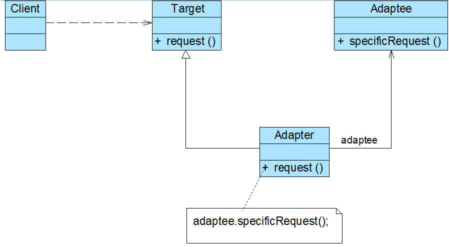
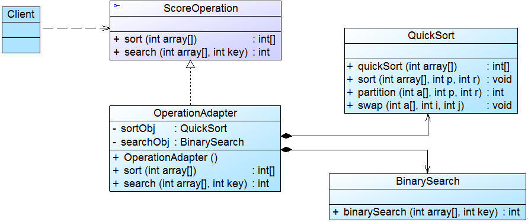
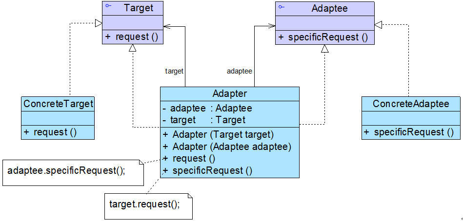
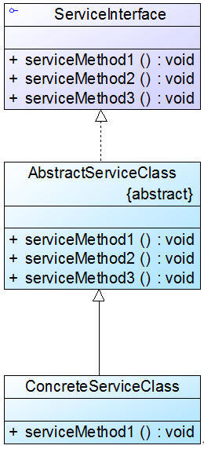
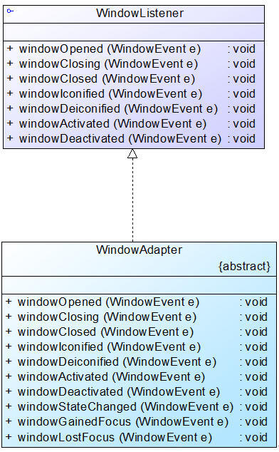

>【学习难度：★★☆☆☆，使用频率：★★★★☆】  
>  直接出处：[适配器模式](http://woquanke.com/books/gof/%E9%80%82%E9%85%8D%E5%99%A8%E6%A8%A1%E5%BC%8F-Adapter%20Pattern.html)  
>  梳理和学习：https://github.com/BruceOuyang/boy-design-pattern  
>  简书日期： 2018/03/09  
>  简书首页：https://www.jianshu.com/p/0fb891a7c5ed  

## 不兼容结构的协调——适配器模式（一）  

我的笔记本电脑的工作电压是20V，而我国的家庭用电是220V，如何让20V的笔记本电脑能够在220V的电压下工作？答案是引入一个电源适配器(AC Adapter)，俗称充电器或变压器，有了这个电源适配器，生活用电和笔记本电脑即可兼容，如图9-1所示：  
 

在软件开发中，有时也存在类似这种不兼容的情况，我们也可以像引入一个电源适配器一样引入一个称之为适配器的角色来协调这些存在不兼容的结构，这种设计方案即为适配器模式。  

9.1 没有源码的算法库  

> Sunny软件公司在很久以前曾开发了一个算法库，里面包含了一些常用的算法，例如排序算法和查找算法，在进行各类软件开发时经常需要重用该算法库中的算法。在为某学校开发教务管理系统时，开发人员发现需要对学生成绩进行排序和查找，该系统的设计人员已经开发了一个成绩操作接口ScoreOperation，在该接口中声明了排序方法sort(int[]) 和查找方法search(int[], int)，为了提高排序和查找的效率，开发人员决定重用算法库中的快速排序算法类QuickSort和二分查找算法类BinarySearch，其中QuickSort的quickSort(int[])方法实现了快速排序，BinarySearch 的binarySearch (int[], int)方法实现了二分查找。  

由于某些原因，现在Sunny公司开发人员已经找不到该算法库的源代码，无法直接通过复制和粘贴操作来重用其中的代码；部分开发人员已经针对ScoreOperation接口编程，如果再要求对该接口进行修改或要求大家直接使用QuickSort类和BinarySearch类将导致大量代码需要修改。  

Sunny软件公司开发人员面对这个没有源码的算法库，遇到一个幸福而又烦恼的问题：如何在既不修改现有接口又不需要任何算法库代码的基础上能够实现算法库的重用？  

通过分析，我们不难得知，现在Sunny软件公司面对的问题有点类似本章最开始所提到的电压问题，成绩操作接口ScoreOperation好比只支持20V电压的笔记本，而算法库好比220V的家庭用电，这两部分都没有办法再进行修改，而且它们原本是两个完全不相关的结构，如图9-2所示：  


现在我们需要ScoreOperation接口能够和已有算法库一起工作，让它们在同一个系统中能够兼容，最好的实现方法是增加一个类似电源适配器一样的适配器角色，通过适配器来协调这两个原本不兼容的结构。如何在软件开发中设计和实现适配器是本章我们将要解决的核心问题，下面就让我们正式开始学习这种用于解决不兼容结构问题的适配器模式。  

9.2 适配器模式概述  

与电源适配器相似，在适配器模式中引入了一个被称为适配器(Adapter)的包装类，而它所包装的对象称为适配者(Adaptee)，即被适配的类。适配器的实现就是把客户类的请求转化为对适配者的相应接口的调用。也就是说：当客户类调用适配器的方法时，在适配器类的内部将调用适配者类的方法，而这个过程对客户类是透明的，客户类并不直接访问适配者类。因此，适配器让那些由于接口不兼容而不能交互的类可以一起工作。  

适配器模式可以将一个类的接口和另一个类的接口匹配起来，而无须修改原来的适配者接口和抽象目标类接口。适配器模式定义如下：  

适配器模式(Adapter Pattern)：将一个接口转换成客户希望的另一个接口，使接口不兼容的那些类可以一起工作，其别名为包装器(Wrapper)。适配器模式既可以作为类结构型模式，也可以作为对象结构型模式。  

【注：在适配器模式定义中所提及的接口是指广义的接口，它可以表示一个方法或者方法的集合。】  

在适配器模式中，我们通过增加一个新的适配器类来解决接口不兼容的问题，使得原本没有任何关系的类可以协同工作。根据适配器类与适配者类的关系不同，适配器模式可分为对象适配器和类适配器两种，在对象适配器模式中，适配器与适配者之间是关联关系；在类适配器模式中，适配器与适配者之间是继承（或实现）关系。在实际开发中，对象适配器的使用频率更高，对象适配器模式结构如图9-3所示：  


在对象适配器模式结构图中包含如下几个角色：  

* Target（目标抽象类）：目标抽象类定义客户所需接口，可以是一个抽象类或接口，也可以是具体类。  

* Adapter（适配器类）：适配器可以调用另一个接口，作为一个转换器，对Adaptee和Target进行适配，适配器类是适配器模式的核心，在对象适配器中，它通过继承Target并关联一个Adaptee对象使二者产生联系。  

* Adaptee（适配者类）：适配者即被适配的角色，它定义了一个已经存在的接口，这个接口需要适配，适配者类一般是一个具体类，包含了客户希望使用的业务方法，在某些情况下可能没有适配者类的源代码。  

根据对象适配器模式结构图，在对象适配器中，客户端需要调用request()方法，而适配者类Adaptee没有该方法，但是它所提供的specificRequest()方法却是客户端所需要的。为了使客户端能够使用适配者类，需要提供一个包装类Adapter，即适配器类。这个包装类包装了一个适配者的实例，从而将客户端与适配者衔接起来，在适配器的request()方法中调用适配者的specificRequest()方法。因为适配器类与适配者类是关联关系（也可称之为委派关系），所以这种适配器模式称为对象适配器模式。典型的对象适配器代码如下所示：  
```java
class Adapter extends Target {  
    private Adaptee adaptee; //维持一个对适配者对象的引用  

    public Adapter(Adaptee adaptee) {  
        this.adaptee=adaptee;  
    }  

    public void request() {  
        adaptee.specificRequest(); //转发调用  
    }  
}
```  

**思考**  
> 在对象适配器中，一个适配器能否适配多个适配者？如果能，应该如何实现？如果不能，请说明原因？  

## 不兼容结构的协调——适配器模式（二）  

9.3 完整解决方案  

Sunny软件公司开发人员决定使用适配器模式来重用算法库中的算法，其基本结构如图9-4所示：  
  

在图9-4中，ScoreOperation接口充当抽象目标，QuickSort和BinarySearch类充当适配者，OperationAdapter充当适配器。完整代码如下所示：  
```java
//抽象成绩操作类：目标接口  
interface ScoreOperation {  
    public int[] sort(int array[]); //成绩排序  
    public int search(int array[],int key); //成绩查找  
}  

//快速排序类：适配者  
class QuickSort {  
    public int[] quickSort(int array[]) {  
        sort(array,0,array.length-1);  
        return array;  
    }  

    public void sort(int array[],int p, int r) {  
        int q=0;  
        if(p<r) {  
            q=partition(array,p,r);  
            sort(array,p,q-1);  
            sort(array,q+1,r);  
        }  
    }  

    public int partition(int[] a, int p, int r) {  
        int x=a[r];  
        int j=p-1;  
        for (int i=p;i<=r-1;i++) {  
            if (a[i]<=x) {  
                j++;  
                swap(a,j,i);  
            }  
        }  
        swap(a,j+1,r);  
        return j+1;   
    }  

    public void swap(int[] a, int i, int j) {     
        int t = a[i];     
        a[i] = a[j];     
        a[j] = t;     
    }  
}  

//二分查找类：适配者  
class BinarySearch {  
    public int binarySearch(int array[],int key) {  
        int low = 0;  
        int high = array.length -1;  
        while(low <= high) {  
            int mid = (low + high) / 2;  
            int midVal = array[mid];  
            if(midVal < key) {    
                low = mid +1;    
            }  
            else if (midVal > key) {    
                high = mid -1;    
            }  
            else {    
                return 1; //找到元素返回1    
            }  
        }  
        return -1;  //未找到元素返回-1  
    }  
}  

//操作适配器：适配器  
class OperationAdapter implements ScoreOperation {  
    private QuickSort sortObj; //定义适配者QuickSort对象  
    private BinarySearch searchObj; //定义适配者BinarySearch对象  

    public OperationAdapter() {  
        sortObj = new QuickSort();  
        searchObj = new BinarySearch();  
    }  

    public int[] sort(int array[]) {    
        return sortObj.quickSort(array); //调用适配者类QuickSort的排序方法  
    }  

    public int search(int array[],int key) {    
        return searchObj.binarySearch(array,key); //调用适配者类BinarySearch的查找方法  
    }
}
```  

为了让系统具备良好的灵活性和可扩展性，我们引入了工具类XMLUtil和配置文件，其中，XMLUtil类的代码如下所示：  
```java
import javax.xml.parsers.*;  
import org.w3c.dom.*;  
import org.xml.sax.SAXException;  
import java.io.*;  
class XMLUtil {  
//该方法用于从XML配置文件中提取具体类类名，并返回一个实例对象  
    public static Object getBean() {  
        try {  
            //创建文档对象  
            DocumentBuilderFactory dFactory = DocumentBuilderFactory.newInstance();  
            DocumentBuilder builder = dFactory.newDocumentBuilder();  
            Document doc;                             
            doc = builder.parse(new File("config.xml"));   

            //获取包含类名的文本节点  
            NodeList nl = doc.getElementsByTagName("className");  
            Node classNode=nl.item(0).getFirstChild();  
            String cName=classNode.getNodeValue();  

            //通过类名生成实例对象并将其返回  
            Class c=Class.forName(cName);  
            Object obj=c.newInstance();  
            return obj;  
        }     
        catch(Exception e) {  
            e.printStackTrace();  
            return null;  
        }  
    }  
}
```  

配置文件config.xml中存储了适配器类的类名，代码如下所示：  
```xml
<?xml version="1.0"?>  
<config>  
    <className>OperationAdapter</className>  
</config>
```  

编写如下客户端测试代码：  
```java
class Client {  
    public static void main(String args[]) {  
        ScoreOperation operation;  //针对抽象目标接口编程  
        operation = (ScoreOperation)XMLUtil.getBean(); //读取配置文件，反射生成对象  
        int scores[] = {84,76,50,69,90,91,88,96}; //定义成绩数组  
        int result[];  
        int score;  

        System.out.println("成绩排序结果：");  
        result = operation.sort(scores);  

        //遍历输出成绩  
        for(int i : scores) {  
            System.out.print(i + ",");  
        }  
        System.out.println();  

        System.out.println("查找成绩90：");  
        score = operation.search(result,90);  
        if (score != -1) {  
            System.out.println("找到成绩90。");  
        }  
        else {  
            System.out.println("没有找到成绩90。");  
        }  

        System.out.println("查找成绩92：");  
        score = operation.search(result,92);  
        if (score != -1) {  
            System.out.println("找到成绩92。");  
        }  
        else {  
            System.out.println("没有找到成绩92。");  
        }  
    }  
}
```  

编译并运行程序，输出结果如下：  
```
成绩排序结果：
50,69,76,84,88,90,91,96,
查找成绩90：
找到成绩90。
查找成绩92：
没有找到成绩92。
```  

在本实例中使用了对象适配器模式，同时引入了配置文件，将适配器类的类名存储在配置文件中。如果需要使用其他排序算法类和查找算法类，可以增加一个新的适配器类，使用新的适配器来适配新的算法，原有代码无须修改。通过引入配置文件和反射机制，可以在不修改客户端代码的情况下使用新的适配器，无须修改源代码，符合“开闭原则”。  

## 不兼容结构的协调——适配器模式（三）  

9.4 类适配器  

除了对象适配器模式之外，适配器模式还有一种形式，那就是类适配器模式，类适配器模式和对象适配器模式最大的区别在于适配器和适配者之间的关系不同，对象适配器模式中适配器和适配者之间是关联关系，而类适配器模式中适配器和适配者是继承关系，类适配器模式结构如图9-5所示：  


根据类适配器模式结构图，适配器类实现了抽象目标类接口Target，并继承了适配者类，在适配器类的request()方法中调用所继承的适配者类的specificRequest()方法，实现了适配。  

典型的类适配器代码如下所示：  
```java
class Adapter extends Adaptee implements Target {  
    public void request() {  
        specificRequest();  
    }  
}
```  

由于Java、C#等语言不支持多重类继承，因此类适配器的使用受到很多限制，例如如果目标抽象类Target不是接口，而是一个类，就无法使用类适配器；此外，如果适配者Adapter为最终(Final)类，也无法使用类适配器。在Java等面向对象编程语言中，大部分情况下我们使用的是对象适配器，类适配器较少使用。  

**思考**  
> 在类适配器中，一个适配器能否适配多个适配者？如果能，应该如何实现？如果不能，请说明原因？

9.5 双向适配器  

在对象适配器的使用过程中，如果在适配器中同时包含对目标类和适配者类的引用，适配者可以通过它调用目标类中的方法，目标类也可以通过它调用适配者类中的方法，那么该适配器就是一个双向适配器，其结构示意图如图9-6所示：  


双向适配器的实现较为复杂，其典型代码如下所示：  
```java
class Adapter implements Target,Adaptee {  
    //同时维持对抽象目标类和适配者的引用  
    private Target target;  
    private Adaptee adaptee;  

    public Adapter(Target target) {  
        this.target = target;  
    }  

    public Adapter(Adaptee adaptee) {  
        this.adaptee = adaptee;  
    }  

    public void request() {  
        adaptee.specificRequest();  
    }  

    public void specificRequest() {  
        target.request();  
    }  
}
```  

在实际开发中，我们很少使用双向适配器。  

## 不兼容结构的协调——适配器模式（四）  

9.6 缺省适配器  

缺省适配器模式是适配器模式的一种变体，其应用也较为广泛。缺省适配器模式的定义如下：  

缺省适配器模式(Default Adapter Pattern)：当不需要实现一个接口所提供的所有方法时，可先设计一个抽象类实现该接口，并为接口中每个方法提供一个默认实现（空方法），那么该抽象类的子类可以选择性地覆盖父类的某些方法来实现需求，它适用于不想使用一个接口中的所有方法的情况，又称为单接口适配器模式。  
  
缺省适配器模式结构如图9-7所示：  


在缺省适配器模式中，包含如下三个角色：  

* ServiceInterface（适配者接口）：它是一个接口，通常在该接口中声明了大量的方法。  

* AbstractServiceClass（缺省适配器类）：它是缺省适配器模式的核心类，使用空方法的形式实现了在ServiceInterface接口中声明的方法。通常将它定义为抽象类，因为对它进行实例化没有任何意义。  

* ConcreteServiceClass（具体业务类）：它是缺省适配器类的子类，在没有引入适配器之前，它需要实现适配者接口，因此需要实现在适配者接口中定义的所有方法，而对于一些无须使用的方法也不得不提供空实现。在有了缺省适配器之后，可以直接继承该适配器类，根据需要有选择性地覆盖在适配器类中定义的方法。  
  
在JDK类库的事件处理包java.awt.event中广泛使用了缺省适配器模式，如WindowAdapter、KeyAdapter、MouseAdapter等。下面我们以处理窗口事件为例来进行说明：在Java语言中，一般我们可以使用两种方式来实现窗口事件处理类，一种是通过实现WindowListener接口，另一种是通过继承WindowAdapter适配器类。如果是使用第一种方式，直接实现WindowListener接口，事件处理类需要实现在该接口中定义的七个方法，而对于大部分需求可能只需要实现一两个方法，其他方法都无须实现，但由于语言特性我们不得不为其他方法也提供一个简单的实现（通常是空实现），这给使用带来了麻烦。而使用缺省适配器模式就可以很好地解决这一问题，在JDK中提供了一个适配器类WindowAdapter来实现WindowListener接口，该适配器类为接口中的每一个方法都提供了一个空实现，此时事件处理类可以继承WindowAdapter类，而无须再为接口中的每个方法都提供实现。如图9-8所示：  
  

9.7 适配器模式总结  

适配器模式将现有接口转化为客户类所期望的接口，实现了对现有类的复用，它是一种使用频率非常高的设计模式，在软件开发中得以广泛应用，在Spring等开源框架、驱动程序设计（如JDBC中的数据库驱动程序）中也使用了适配器模式。  

1. 主要优点

无论是对象适配器模式还是类适配器模式都具有如下优点：  

(1) 将目标类和适配者类解耦，通过引入一个适配器类来重用现有的适配者类，无须修改原有结构。  

(2) 增加了类的透明性和复用性，将具体的业务实现过程封装在适配者类中，对于客户端类而言是透明的，而且提高了适配者的复用性，同一个适配者类可以在多个不同的系统中复用。  

(3) 灵活性和扩展性都非常好，通过使用配置文件，可以很方便地更换适配器，也可以在不修改原有代码的基础上增加新的适配器类，完全符合“开闭原则”。  

具体来说，类适配器模式还有如下优点：  

由于适配器类是适配者类的子类，因此可以在适配器类中置换一些适配者的方法，使得适配器的灵活性更强。  

对象适配器模式还有如下优点：  

(1) 一个对象适配器可以把多个不同的适配者适配到同一个目标；  

(2) 可以适配一个适配者的子类，由于适配器和适配者之间是关联关系，根据“里氏代换原则”，适配者的子类也可通过该适配器进行适配。  

2. 主要缺点  

类适配器模式的缺点如下：  

(1) 对于Java、C#等不支持多重类继承的语言，一次最多只能适配一个适配者类，不能同时适配多个适配者；  

(2) 适配者类不能为最终类，如在Java中不能为final类，C#中不能为sealed类；  

(3) 在Java、C#等语言中，类适配器模式中的目标抽象类只能为接口，不能为类，其使用有一定的局限性。  

对象适配器模式的缺点如下：  

与类适配器模式相比，要在适配器中置换适配者类的某些方法比较麻烦。如果一定要置换掉适配者类的一个或多个方法，可以先做一个适配者类的子类，将适配者类的方法置换掉，然后再把适配者类的子类当做真正的适配者进行适配，实现过程较为复杂。  

3. 适用场景  

在以下情况下可以考虑使用适配器模式：  

(1) 系统需要使用一些现有的类，而这些类的接口（如方法名）不符合系统的需要，甚至没有这些类的源代码。  

(2) 想创建一个可以重复使用的类，用于与一些彼此之间没有太大关联的一些类，包括一些可能在将来引进的类一起工作。  

**练习**  
> Sunny软件公司OA系统需要提供一个加密模块，将用户机密信息（如口令、邮箱等）加密之后再存储在数据库中，系统已经定义好了数据库操作类。为了提高开发效率，现需要重用已有的加密算法，这些算法封装在一些由第三方提供的类中，有些甚至没有源代码。试使用适配器模式设计该加密模块，实现在不修改现有类的基础上重用第三方加密方法。

> 练习会在[我的github](https://github.com/BruceOuyang/boy-design-pattern)上做掉