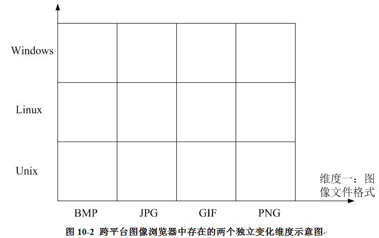
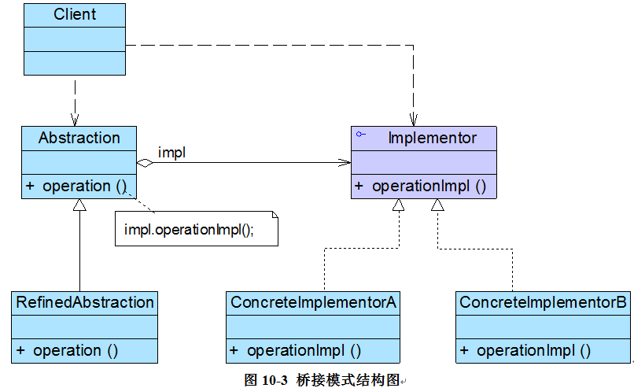
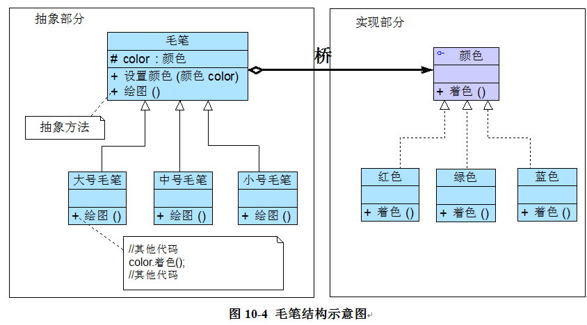

> 【学习难度：★★★☆☆，使用频率：★★★☆☆】  
>  直接出处：[桥接模式](http://woquanke.com/books/gof/%E6%A1%A5%E6%8E%A5%E6%A8%A1%E5%BC%8F-Bridge%20Pattern.html)  
>  梳理和学习：https://github.com/BruceOuyang/boy-design-pattern  
>  简书日期： 2018/03/09  
>  简书首页：https://www.jianshu.com/p/0fb891a7c5ed  

## 处理多维度变化——桥接模式（一）

在正式介绍桥接模式之前，我先跟大家谈谈两种常见文具的区别，它们是毛笔和蜡笔。假如我们需要大中小3种型号的画笔，能够绘制12种不同的颜色，如果使用蜡笔，需要准备3×12 = 36支，但如果使用毛笔的话，只需要提供3种型号的毛笔，外加12个颜料盒即可，涉及到的对象个数仅为 3 + 12 = 15，远小于36，却能实现与36支蜡笔同样的功能。如果增加一种新型号的画笔，并且也需要具有12种颜色，对应的蜡笔需增加12支，而毛笔只需增加一支。为什么会这样呢？通过分析我们可以得知：在蜡笔中，颜色和型号两个不同的变化维度（即两个不同的变化原因）融合在一起，无论是对颜色进行扩展还是对型号进行扩展都势必会影响另一个维度；但在毛笔中，颜色和型号实现了分离，增加新的颜色或者型号对另一方都没有任何影响。如果使用软件工程中的术语，我们可以认为在蜡笔中颜色和型号之间存在较强的耦合性，而毛笔很好地将二者解耦，使用起来非常灵活，扩展也更为方便。在软件开发中，我们也提供了一种设计模式来处理与画笔类似的具有多变化维度的情况，即本章将要介绍的桥接模式。  

10.1 跨平台图像浏览系统  

Sunny软件公司欲开发一个跨平台图像浏览系统，要求该系统能够显示BMP、JPG、GIF、PNG等多种格式的文件，并且能够在Windows、Linux、Unix等多个操作系统上运行。系统首先将各种格式的文件解析为像素矩阵(Matrix)，然后将像素矩阵显示在屏幕上，在不同的操作系统中可以调用不同的绘制函数来绘制像素矩阵。系统需具有较好的扩展性以支持新的文件格式和操作系统。  

Sunny软件公司的开发人员针对上述要求，提出了一个初始设计方案，其基本结构如图10-1所示：  
  

在图10-1的初始设计方案中，使用了一种多层继承结构，Image是抽象父类，而每一种类型的图像类，如BMPImage、JPGImage等作为其直接子类，不同的图像文件格式具有不同的解析方法，可以得到不同的像素矩阵；由于每一种图像又需要在不同的操作系统中显示，不同的操作系统在屏幕上显示像素矩阵有所差异，因此需要为不同的图像类再提供一组在不同操作系统显示的子类，如为BMPImage提供三个子类BMPWindowsImp、BMPLinuxImp和BMPUnixImp，分别用于在Windows、Linux和Unix三个不同的操作系统下显示图像。  

我们现在对该设计方案进行分析，发现存在如下两个主要问题：  

(1)由于采用了多层继承结构，导致系统中类的个数急剧增加，图10-1中，在各种图像的操作系统实现层提供了12个具体类，加上各级抽象层的类，系统中类的总个数达到了17个，在该设计方案中，具体层的类的个数 = 所支持的图像文件格式数×所支持的操作系统数。  

(2)系统扩展麻烦，由于每一个具体类既包含图像文件格式信息，又包含操作系统信息，因此无论是增加新的图像文件格式还是增加新的操作系统，都需要增加大量的具体类，例如在图10-1中增加一种新的图像文件格式TIF，则需要增加3个具体类来实现该格式图像在3种不同操作系统的显示；如果增加一个新的操作系统Mac OS，为了在该操作系统下能够显示各种类型的图像，需要增加4个具体类。这将导致系统变得非常庞大，增加运行和维护开销。  
  
如何解决这两个问题？我们通过分析可得知，该系统存在两个独立变化的维度：图像文件格式和操作系统，如图10-2所示：  


在图10-2中，如何将各种不同类型的图像文件解析为像素矩阵与图像文件格式本身相关，而如何在屏幕上显示像素矩阵则仅与操作系统相关。正因为图10-1所示结构将这两种职责集中在一个类中，导致系统扩展麻烦，从类的设计角度分析，具体类BMPWindowsImp、BMPLinuxImp和BMPUnixImp等违反了“单一职责原则”，因为不止一个引起它们变化的原因，它们将图像文件解析和像素矩阵显示这两种完全不同的职责融合在一起，任意一个职责发生改变都需要修改它们，系统扩展困难。

如何改进？我们的方案是将图像文件格式（对应图像格式的解析）与操作系统（对应像素矩阵的显示）两个维度分离，使得它们可以独立变化，增加新的图像文件格式或者操作系统时都对另一个维度不造成任何影响。看到这里，大家可能会问，到底如何在软件中实现将两个维度分离呢？不用着急，本章我将为大家详细介绍一种用于处理多维度变化的设计模式——桥接模式。  

## 处理多维度变化——桥接模式（二）  

10.2 桥接模式概述  

桥接模式是一种很实用的结构型设计模式，如果软件系统中某个类存在两个独立变化的维度，通过该模式可以将这两个维度分离出来，使两者可以独立扩展，让系统更加符合“单一职责原则”。与多层继承方案不同，它将两个独立变化的维度设计为两个独立的继承等级结构，并且在抽象层建立一个抽象关联，该关联关系类似一条连接两个独立继承结构的桥，故名桥接模式。  

桥接模式用一种巧妙的方式处理多层继承存在的问题，用抽象关联取代了传统的多层继承，将类之间的静态继承关系转换为动态的对象组合关系，使得系统更加灵活，并易于扩展，同时有效控制了系统中类的个数。桥接定义如下：  

桥接模式(Bridge Pattern)：将抽象部分与它的实现部分分离，使它们都可以独立地变化。它是一种对象结构型模式，又称为柄体(Handle and Body)模式或接口(Interface)模式  

桥接模式的结构与其名称一样，存在一条连接两个继承等级结构的桥，桥接模式结构如图10-3所示：  
  

在桥接模式结构图中包含如下几个角色：  

* Abstraction（抽象类）：用于定义抽象类的接口，它一般是抽象类而不是接口，其中定义了一个Implementor（实现类接口）类型的对象并可以维护该对象，它与Implementor之间具有关联关系，它既可以包含抽象业务方法，也可以包含具体业务方法。  
  
* RefinedAbstraction（扩充抽象类）：扩充由Abstraction定义的接口，通常情况下它不再是抽象类而是具体类，它实现了在Abstraction中声明的抽象业务方法，在RefinedAbstraction中可以调用在Implementor中定义的业务方法。  
  
* Implementor（实现类接口）：定义实现类的接口，这个接口不一定要与Abstraction的接口完全一致，事实上这两个接口可以完全不同，一般而言，Implementor接口仅提供基本操作，而Abstraction定义的接口可能会做更多更复杂的操作。Implementor接口对这些基本操作进行了声明，而具体实现交给其子类。通过关联关系，在Abstraction中不仅拥有自己的方法，还可以调用到Implementor中定义的方法，使用关联关系来替代继承关系。  
  
* ConcreteImplementor（具体实现类）：具体实现Implementor接口，在不同的ConcreteImplementor中提供基本操作的不同实现，在程序运行时，ConcreteImplementor对象将替换其父类对象，提供给抽象类具体的业务操作方法。  

在使用桥接模式时，我们首先应该识别出一个类所具有的两个独立变化的维度，将它们设计为两个独立的继承等级结构，为两个维度都提供抽象层，并建立抽象耦合。通常情况下，我们将具有两个独立变化维度的类的一些普通业务方法和与之关系最密切的维度设计为“抽象类”层次结构（抽象部分），而将另一个维度设计为“实现类”层次结构（实现部分）。例如：对于毛笔而言，由于型号是其固有的维度，因此可以设计一个抽象的毛笔类，在该类中声明并部分实现毛笔的业务方法，而将各种型号的毛笔作为其子类；颜色是毛笔的另一个维度，由于它与毛笔之间存在一种“设置”的关系，因此我们可以提供一个抽象的颜色接口，而将具体的颜色作为实现该接口的子类。在此，型号可认为是毛笔的抽象部分，而颜色是毛笔的实现部分，结构示意图如图10-4所示：  


在图10-4中，如果需要增加一种新型号的毛笔，只需扩展左侧的“抽象部分”，增加一个新的扩充抽象类；如果需要增加一种新的颜色，只需扩展右侧的“实现部分”，增加一个新的具体实现类。扩展非常方便，无须修改已有代码，且不会导致类的数目增长过快。  

在具体编码实现时，由于在桥接模式中存在两个独立变化的维度，为了使两者之间耦合度降低，首先需要针对两个不同的维度提取抽象类和实现类接口，并建立一个抽象关联关系。对于“实现部分”维度，典型的实现类接口代码如下所示：  
```java
interface Implementor {  
    public void operationImpl();  
}
```  

在实现Implementor接口的子类中实现了在该接口中声明的方法，用于定义与该维度相对应的一些具体方法。  

对于另一“抽象部分”维度而言，其典型的抽象类代码如下所示：  
```java
abstract class Abstraction {  
    
    //定义实现类接口对象 
    protected Implementor impl;  

    public void setImpl(Implementor impl) {  
        this.impl=impl;  
    }  

    //   
    public abstract void operation();   
}
```  

在抽象类Abstraction中定义了一个实现类接口类型的成员对象impl，再通过注入的方式给该对象赋值，一般将该对象的可见性定义为protected，以便在其子类中访问Implementor的方法，其子类一般称为扩充抽象类或细化抽象类(RefinedAbstraction)，典型的RefinedAbstraction类代码如下所示：  
```java
class RefinedAbstraction extends Abstraction {  
    public void operation() {  
        //业务代码  
        impl.operationImpl();  //调用实现类的方法  
        //业务代码  
    }  
}
```  

对于客户端而言，可以针对两个维度的抽象层编程，在程序运行时再动态确定两个维度的子类，动态组合对象，将两个独立变化的维度完全解耦，以便能够灵活地扩充任一维度而对另一维度不造成任何影响。  

**思考**  
> 如果系统中存在两个以上的变化维度，是否可以使用桥接模式进行处理？如果可以，系统该如何设计？
  
## 处理多维度变化——桥接模式（三）

10.3 完整解决方案  

为了减少所需生成的子类数目，实现将操作系统和图像文件格式两个维度分离，使它们可以独立改变，Sunny公司开发人员使用桥接模式来重构跨平台图像浏览系统的设计，其基本结构如图10-5所示：  


在图10-5中，Image充当抽象类，其子类JPGImage、PNGImage、BMPImage和GIFImage充当扩充抽象类；ImageImp充当实现类接口，其子类WindowsImp、LinuxImp和UnixImp充当具体实现类。完整代码如下所示：  
```java
//像素矩阵类：辅助类，各种格式的文件最终都被转化为像素矩阵，不同的操作系统提供不同的方式显示像素矩阵  
class Matrix {  
    //此处代码省略  
}  

//抽象图像类：抽象类  
abstract class Image {  
    protected ImageImp imp;  

    public void setImageImp(ImageImp imp) {  
        this.imp = imp;  
    }   

    public abstract void parseFile(String fileName);  
}  

//抽象操作系统实现类：实现类接口  
interface ImageImp {  
    public void doPaint(Matrix m);  //显示像素矩阵m  
}   

//Windows操作系统实现类：具体实现类  
class WindowsImp implements ImageImp {  
    public void doPaint(Matrix m) {  
        //调用Windows系统的绘制函数绘制像素矩阵  
        System.out.print("在Windows操作系统中显示图像：");  
    }  
}  

//Linux操作系统实现类：具体实现类  
class LinuxImp implements ImageImp {  
    public void doPaint(Matrix m) {  
        //调用Linux系统的绘制函数绘制像素矩阵  
        System.out.print("在Linux操作系统中显示图像：");  
    }  
}  

//Unix操作系统实现类：具体实现类  
class UnixImp implements ImageImp {  
    public void doPaint(Matrix m) {  
        //调用Unix系统的绘制函数绘制像素矩阵  
        System.out.print("在Unix操作系统中显示图像：");  
    }  
}  

//JPG格式图像：扩充抽象类  
class JPGImage extends Image {  
    public void parseFile(String fileName) {  
        //模拟解析JPG文件并获得一个像素矩阵对象m;  
        Matrix m = new Matrix();   
        imp.doPaint(m);  
        System.out.println(fileName + "，格式为JPG。");  
    }  
}  

//PNG格式图像：扩充抽象类  
class PNGImage extends Image {  
    public void parseFile(String fileName) {  
        //模拟解析PNG文件并获得一个像素矩阵对象m;  
        Matrix m = new Matrix();   
        imp.doPaint(m);  
        System.out.println(fileName + "，格式为PNG。");  
    }  
}  

//BMP格式图像：扩充抽象类  
class BMPImage extends Image {  
    public void parseFile(String fileName) {  
        //模拟解析BMP文件并获得一个像素矩阵对象m;  
        Matrix m = new Matrix();   
        imp.doPaint(m);  
        System.out.println(fileName + "，格式为BMP。");  
    }  
}  

//GIF格式图像：扩充抽象类  
class GIFImage extends Image {  
    public void parseFile(String fileName) {  
        //模拟解析GIF文件并获得一个像素矩阵对象m;  
        Matrix m = new Matrix();   
        imp.doPaint(m);  
        System.out.println(fileName + "，格式为GIF。");  
    }  
}
```  

为了让系统具有更好的灵活性和可扩展性，我们引入了配置文件，将具体扩充抽象类和具体实现类类名都存储在配置文件中，再通过反射生成对象，将生成的具体实现类对象注入到扩充抽象类对象中，其中，配置文件config.xml的代码如下所示：  
```xml
<?xml version="1.0"?>  
<config>  
    <!--RefinedAbstraction-->  
    <className>JPGImage</className>   
    <!--ConcreteImplementor-->  
    <className>WindowsImp</className>  
</config>
```  

用于读取配置文件config.xml并反射生成对象的XMLUtil类的代码如下所示：  
```java
import javax.xml.parsers.*;  
import org.w3c.dom.*;  
import org.xml.sax.SAXException;  
import java.io.*;  
public class XMLUtil {  
//该方法用于从XML配置文件中提取具体类类名，并返回一个实例对象  
    public static Object getBean(String args) {  
        try {  
            //创建文档对象  
            DocumentBuilderFactory dFactory = DocumentBuilderFactory.newInstance();  
            DocumentBuilder builder = dFactory.newDocumentBuilder();  
            Document doc;                             
            doc = builder.parse(new File("config.xml"));   
            NodeList nl=null;  
            Node classNode=null;  
            String cName=null;  
            nl = doc.getElementsByTagName("className");  

            if(args.equals("image")) {  
                //获取第一个包含类名的节点，即扩充抽象类  
                classNode=nl.item(0).getFirstChild();  

            }  
            else if(args.equals("os")) {  
               //获取第二个包含类名的节点，即具体实现类  
                classNode=nl.item(1).getFirstChild();  
            }  

             cName=classNode.getNodeValue();  
             //通过类名生成实例对象并将其返回  
             Class c=Class.forName(cName);  
             Object obj=c.newInstance();  
             return obj;          
           }     
           catch(Exception e) {  
              e.printStackTrace();  
              return null;  
          }  
     }  
}
```  

编写如下客户端测试代码：  
```java
class Client {  
    public static void main(String args[]) {  
        Image image;  
        ImageImp imp;  
        image = (Image)XMLUtil.getBean("image");  
        imp = (ImageImp)XMLUtil.getBean("os");  
        image.setImageImp(imp);  
        image.parseFile("小龙女");  
    }  
}
```  

编译并运行程序，输出结果如下：
```
在Windows操作系统中显示图像：小龙女，格式为JPG。
```

如果需要更换图像文件格式或者更换操作系统，只需修改配置文件即可，在实际使用时，可以通过分析图像文件格式后缀名来确定具体的文件格式，在程序运行时获取操作系统信息来确定操作系统类型，无须使用配置文件。当增加新的图像文件格式或者操作系统时，原有系统无须做任何修改，只需增加一个对应的扩充抽象类或具体实现类即可，系统具有较好的可扩展性，完全符合“开闭原则”。  

## 处理多维度变化——桥接模式（四）  

10.4 适配器模式与桥接模式的联用  

在软件开发中，适配器模式通常可以与桥接模式联合使用。适配器模式可以解决两个已有接口间不兼容问题，在这种情况下被适配的类往往是一个黑盒子，有时候我们不想也不能改变这个被适配的类，也不能控制其扩展。适配器模式通常用于现有系统与第三方产品功能的集成，采用增加适配器的方式将第三方类集成到系统中。桥接模式则不同，用户可以通过接口继承或类继承的方式来对系统进行扩展。  

桥接模式和适配器模式用于设计的不同阶段，桥接模式用于系统的初步设计，对于存在两个独立变化维度的类可以将其分为抽象化和实现化两个角色，使它们可以分别进行变化；而在初步设计完成之后，当发现系统与已有类无法协同工作时，可以采用适配器模式。但有时候在设计初期也需要考虑适配器模式，特别是那些涉及到大量第三方应用接口的情况。  

下面通过一个实例来说明适配器模式和桥接模式的联合使用：  

在某系统的报表处理模块中，需要将报表显示和数据采集分开，系统可以有多种报表显示方式也可以有多种数据采集方式，如可以从文本文件中读取数据，也可以从数据库中读取数据，还可以从Excel文件中获取数据。如果需要从Excel文件中获取数据，则需要调用与Excel相关的API，而这个API是现有系统所不具备的，该API由厂商提供。使用适配器模式和桥接模式设计该模块。  

在设计过程中，由于存在报表显示和数据采集两个独立变化的维度，因此可以使用桥接模式进行初步设计；为了使用Excel相关的API来进行数据采集则需要使用适配器模式。系统的完整设计中需要将两个模式联用，如图10-6所示：  


10.5 桥接模式总结

桥接模式是设计Java虚拟机和实现JDBC等驱动程序的核心模式之一，应用较为广泛。在软件开发中如果一个类或一个系统有多个变化维度时，都可以尝试使用桥接模式对其进行设计。桥接模式为多维度变化的系统提供了一套完整的解决方案，并且降低了系统的复杂度。  

1. 主要优点  

桥接模式的主要优点如下：  

(1)分离抽象接口及其实现部分。桥接模式使用“对象间的关联关系”解耦了抽象和实现之间固有的绑定关系，使得抽象和实现可以沿着各自的维度来变化。所谓抽象和实现沿着各自维度的变化，也就是说抽象和实现不再在同一个继承层次结构中，而是“子类化”它们，使它们各自都具有自己的子类，以便任何组合子类，从而获得多维度组合对象。  

(2)在很多情况下，桥接模式可以取代多层继承方案，多层继承方案违背了“单一职责原则”，复用性较差，且类的个数非常多，桥接模式是比多层继承方案更好的解决方法，它极大减少了子类的个数。  

(3)桥接模式提高了系统的可扩展性，在两个变化维度中任意扩展一个维度，都不需要修改原有系统，符合“开闭原则”。  

2. 主要缺点

桥接模式的主要缺点如下：

(1)桥接模式的使用会增加系统的理解与设计难度，由于关联关系建立在抽象层，要求开发者一开始就针对抽象层进行设计与编程。 

(2)桥接模式要求正确识别出系统中两个独立变化的维度，因此其使用范围具有一定的局限性，如何正确识别两个独立维度也需要一定的经验积累。  

3. 适用场景

在以下情况下可以考虑使用桥接模式：

(1)如果一个系统需要在抽象化和具体化之间增加更多的灵活性，避免在两个层次之间建立静态的继承关系，通过桥接模式可以使它们在抽象层建立一个关联关系。  

(2)“抽象部分”和“实现部分”可以以继承的方式独立扩展而互不影响，在程序运行时可以动态将一个抽象化子类的对象和一个实现化子类的对象进行组合，即系统需要对抽象化角色和实现化角色进行动态耦合。  

(3)一个类存在两个（或多个）独立变化的维度，且这两个（或多个）维度都需要独立进行扩展。  

(4)对于那些不希望使用继承或因为多层继承导致系统类的个数急剧增加的系统，桥接模式尤为适用。  

**练习**
> Sunny软件公司欲开发一个数据转换工具，可以将数据库中的数据转换成多种文件格式，例如txt、xml、pdf等格式，同时该工具需要支持多种不同的数据库。试使用桥接模式对其进行设计。


> 练习会在[我的github](https://github.com/BruceOuyang/boy-design-pattern)上做掉

### 最后 <!--{docsify-ignore}-->
如果你喜欢老欧整理的文章，欢迎你关注我的微信公众号，老欧的issueList站点文章更新时，会同步推送到微信公众号。
