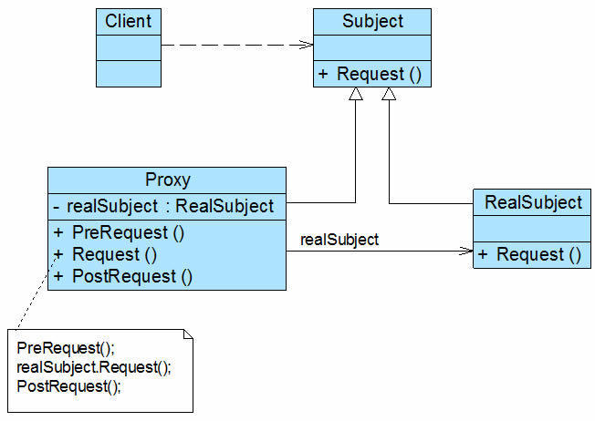
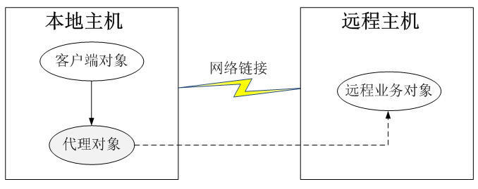
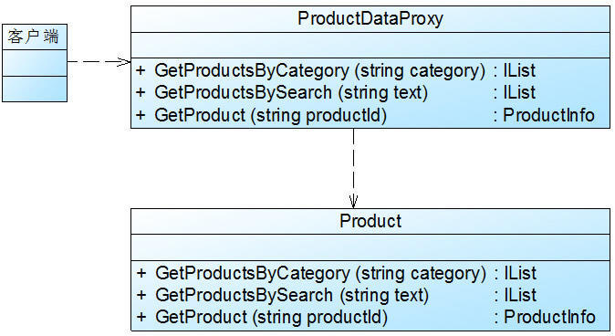
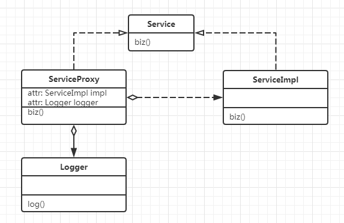

> 【学习难度：★★★☆☆，使用频率：★★★★☆】  
>  直接出处：[代理模式](http://woquanke.com/books/gof/%E4%BB%A3%E7%90%86%E6%A8%A1%E5%BC%8F-Proxy%20Pattern.html)  
>  梳理和学习：https://github.com/BruceOuyang/boy-design-pattern  
>  简书日期： 2018/03/15  
>  简书首页：https://www.jianshu.com/p/0fb891a7c5ed  

## 设计模式之代理模式（一）

代理模式是常用的结构型设计模式之一，当无法直接访问某个对象或访问某个对象存在困难时可以通过一个代理对象来间接访问，为了保证客户端使用的透明性，所访问的真实对象与代理对象需要实现相同的接口。根据代理模式的使用目的不同，代理模式又可以分为多种类型，例如保护代理、远程代理、虚拟代理、缓冲代理等，它们应用于不同的场合，满足用户的不同需求。

15.1 代理模式概述

近年来，代购已逐步成为电子商务的一个重要分支。何谓代购，简单来说就是找人帮忙购买所需要的商品，当然你可能需要向实施代购的人支付一定的费用。代购通常分为两种类型：一种是因为在当地买不到某件商品，又或者是因为当地这件商品的价格比其他地区的贵，因此托人在其他地区甚至国外购买该商品，然后通过快递发货或者直接携带回来；还有一种代购，由于消费者对想要购买的商品相关信息的缺乏，自已无法确定其实际价值而又不想被商家宰，只好委托中介机构帮其讲价或为其代买。代购网站为此应运而生，它为消费者提供在线的代购服务，如果看中某国外购物网站上的商品，可以登录代购网站填写代购单并付款，代购网站会帮助进行购买然后通过快递公司将商品发送给消费者。商品代购过程如图15-1所示：  
  

在软件开发中，也有一种设计模式可以提供与代购网站类似的功能。由于某些原因，客户端不想或不能直接访问一个对象，此时可以通过一个称之为“代理”的第三者来实现间接访问，该方案对应的设计模式被称为代理模式。

代理模式是一种应用很广泛的结构型设计模式，而且变化形式非常多，常见的代理形式包括远程代理、保护代理、虚拟代理、缓冲代理、智能引用代理等，后面将学习这些不同的代理形式。

代理模式定义如下：  

代理模式：给某一个对象提供一个代理或占位符，并由代理对象来控制对原对象的访问。 Proxy Pattern: Provide a surrogate or placeholder for another object to control access to it.  

代理模式是一种对象结构型模式。在代理模式中引入了一个新的代理对象，代理对象在客户端对象和目标对象之间起到中介的作用，它去掉客户不能看到的内容和服务或者增添客户需要的额外的新服务。  

15.2 代理模式结构与实现

15.2.1 模式结构

代理模式的结构比较简单，其核心是代理类，为了让客户端能够一致性地对待真实对象和代理对象，在代理模式中引入了抽象层，代理模式结构如图15-2所示：  
  

由图15-2可知，代理模式包含如下三个角色：  

(1) Subject（抽象主题角色）：它声明了真实主题和代理主题的共同接口，这样一来在任何使用真实主题的地方都可以使用代理主题，客户端通常需要针对抽象主题角色进行编程。  

(2) Proxy（代理主题角色）：它包含了对真实主题的引用，从而可以在任何时候操作真实主题对象；在代理主题角色中提供一个与真实主题角色相同的接口，以便在任何时候都可以替代真实主题；代理主题角色还可以控制对真实主题的使用，负责在需要的时候创建和删除真实主题对象，并对真实主题对象的使用加以约束。通常，在代理主题角色中，客户端在调用所引用的真实主题操作之前或之后还需要执行其他操作，而不仅仅是单纯调用真实主题对象中的操作。  

(3) RealSubject（真实主题角色）：它定义了代理角色所代表的真实对象，在真实主题角色中实现了真实的业务操作，客户端可以通过代理主题角色间接调用真实主题角色中定义的操作。  

15.2.2 模式实现

代理模式的结构图比较简单，但是在真实的使用和实现过程中要复杂很多，特别是代理类的设计和实现。  

抽象主题类声明了真实主题类和代理类的公共方法，它可以是接口、抽象类或具体类，客户端针对抽象主题类编程，一致性地对待真实主题和代理主题，典型的抽象主题类代码如下：  
```java
public abstract class Subject  
{  
    public abstract void request();  
}
```

真实主题类继承了抽象主题类，提供了业务方法的具体实现，其典型代码如下：  
```java
public class RealSubject extends Subject  
{  
    @Override
    public void request()  
    {  
        //业务方法具体实现代码  
    }  
}
```

代理类也是抽象主题类的子类，它维持一个对真实主题对象的引用，调用在真实主题中实现的业务方法，在调用时可以在原有业务方法的基础上附加一些新的方法来对功能进行扩充或约束，最简单的代理类实现代码如下：  
```java
class Proxy extends Subject  
{  
    /**
     * 维持一个对真实主题对象的引用 
     */
    private RealSubject realSubject = new RealSubject();   

    public void preRequest()   
    {
        //...  
    }  

    @Override
    public void request()   
    {  
        preRequest();  
        
        // 调用真实主题对象的方法 
        realSubject.request();  
        
        postRequest();  
    }  

    public void PostRequest()   
    {  
        // …  
    }  
}
```

在实际开发过程中，代理类的实现比上述代码要复杂很多，代理模式根据其目的和实现方式不同可分为很多种类，其中常用的几种代理模式简要说明如下：  

(1) 远程代理(Remote Proxy)：为一个位于不同的地址空间的对象提供一个本地的代理对象，这个不同的地址空间可以是在同一台主机中，也可是在另一台主机中，远程代理又称为大使(Ambassador)。  

(2) 虚拟代理(Virtual Proxy)：如果需要创建一个资源消耗较大的对象，先创建一个消耗相对较小的对象来表示，真实对象只在需要时才会被真正创建。  

(3) 保护代理(Protect Proxy)：控制对一个对象的访问，可以给不同的用户提供不同级别的使用权限。  

(4) 缓冲代理(Cache Proxy)：为某一个目标操作的结果提供临时的存储空间，以便多个客户端可以共享这些结果。  

(5) 智能引用代理(Smart Reference Proxy)：当一个对象被引用时，提供一些额外的操作，例如将对象被调用的次数记录下来等。  

在这些常用的代理模式中，有些代理类的设计非常复杂，例如远程代理类，它封装了底层网络通信和对远程对象的调用，其实现较为复杂。

## 设计模式之代理模式（二）

15.3 代理模式应用实例

下面通过一个应用实例来进一步学习和理解代理模式。

15.3.1 实例说明

某软件公司承接了某信息咨询公司的收费商务信息查询系统的开发任务，该系统的基本需求如下：  

(1) 在进行商务信息查询之前用户需要通过身份验证，只有合法用户才能够使用该查询系统；  

(2) 在进行商务信息查询时系统需要记录查询日志，以便根据查询次数收取查询费用。  

该软件公司开发人员已完成了商务信息查询模块的开发任务，现希望能够以一种松耦合的方式向原有系统增加身份验证和日志记录功能，客户端代码可以无区别地对待原始的商务信息查询模块和增加新功能之后的商务信息查询模块，而且可能在将来还要在该信息查询模块中增加一些新的功能。  

试使用代理模式设计并实现该收费商务信息查询系统。

15.3.2 实例分析及类图

通过分析，可以采用一种间接访问的方式来实现该商务信息查询系统的设计，在客户端对象和信息查询对象之间增加一个代理对象，让代理对象来实现身份验证和日志记录等功能，而无须直接对原有的商务信息查询对象进行修改，如图15-3所示：  
  

在图15-3中，客户端对象通过代理对象间接访问具有商务信息查询功能的真实对象，在代理对象中除了调用真实对象的商务信息查询功能外，还增加了身份验证和日志记录等功能。使用代理模式设计该商务信息查询系统，结构图如图15-4所示。  
  

在图15-4中，业务类AccessValidator用于验证用户身份，业务类Logger用于记录用户查询日志，Searcher充当抽象主题角色，RealSearcher充当真实主题角色，ProxySearcher充当代理主题角色。  

15.3.3 实例代码

(1) AccessValidator：身份验证类，业务类，它提供方法Validate()来实现身份验证。  
```java
class AccessValidator  
{  
    //模拟实现登录验证  
    public boolean validate(string userId)   
    {  
        System.out.println("在数据库中验证用户'" + userId + "'是否是合法用户？");  
        if (userId.equals("杨过")) {  
            System.out.println("'{0}'登录成功！",userId);  
            return true;  
        }  
        else {  
            System.out.println("'{0}'登录失败！", userId);  
            return false;  
        }  
    }  
}  
```

(2) Logger：日志记录类，业务类，它提供方法Log()来保存日志。  
```java
class Logger  
{  
    //模拟实现日志记录  
    public void log(string userId) {  
        System.out.println("更新数据库，用户'{0}'查询次数+1！",userId);  
    }  
} 
```

(3) Searcher：抽象查询类，充当抽象主题角色，它声明了DoSearch()方法。  
```java
interface Searcher  
{  
    String doSearch(string userId, string keyword);  
}  
```

(4) RealSearcher：具体查询类，充当真实主题角色，它实现查询功能，提供方法DoSearch()来查询信息。  
```java
class RealSearcher implements Searcher  
{  
    //模拟查询商务信息  
    public string doSearch(string userId, string keyword) {  
        System.out.println("用户'{0}'使用关键词'{1}'查询商务信息！",userId,keyword);  
        return "返回具体内容";  
    }  
}
```

(5) ProxySearcher：代理查询类，充当代理主题角色，它是查询代理，维持了对RealSearcher对象、AccessValidator对象和Logger对象的引用。  
```java
class ProxySearcher implements Searcher  
{  
    /**
     * 维持一个对真实主题的引用
     */
    private RealSearcher searcher = new RealSearcher();   
    private AccessValidator validator;  
    private Logger logger;  

    public string doSearch(string userId, string keyword)  
    {  
        //如果身份验证成功，则执行查询  
        if (this.validate(userId))  
        {  
            string result = searcher.doSearch(userId, keyword); //调用真实主题对象的查询方法  
            this.Log(userId); //记录查询日志  
            return result; //返回查询结果  
        }  
        else  
        {  
            return null;  
        }  
    }  

    //创建访问验证对象并调用其Validate()方法实现身份验证  
    public bool validate(string userId)  
    {  
        validator = new AccessValidator();  
        return validator.Validate(userId);  
    }  

    //创建日志记录对象并调用其Log()方法实现日志记录  
    public void log(string userId)  
    {  
        logger = new Logger();  
        logger.Log(userId);  
    }  
} 
```

(6) 配置文件App.config，在配置文件中存储了代理主题类类名。  
```xml
<?xml version="1.0" encoding="utf-8" ?>  
<configuration>  
  <appSettings>  
    <add key="proxy" value="ProxySample.ProxySearcher"/>  
  </appSettings>  
</configuration>
```  

(7) Client：客户端测试类  
```java
class Client  
{  
    public static void main(String[] args)  
    {  
        //读取配置文件  
        String proxy = ConfigurationManager.AppSettings["proxy"];  

        //反射生成对象，针对抽象编程，客户端无须分辨真实主题类和代理类  
        Searcher searcher = (Searcher)ProxyXMLUtil.getBean();  

        String result = searcher.doSearch("杨过", "玉女心经");   
    }  
} 
```

15.3.4 结果及分析

编译并运行程序，输出结果如下：  
```
在数据库中验证用户'杨过'是否是合法用户？
'杨过'登录成功！
用户'杨过'使用关键词'玉女心经'查询商务信息！
更新数据库，用户'杨过'查询次数加1！
```

本实例是保护代理和智能引用代理的应用实例，在代理类ProxySearcher中实现对真实主题类的权限控制和引用计数，如果需要在访问真实主题时增加新的访问控制机制和新功能，只需增加一个新的代理类，再修改配置文件，在客户端代码中使用新增代理类即可，源代码无须修改，符合开闭原则。  

## 设计模式之代理模式（三）

15.4 远程代理

远程代理(Remote Proxy)是一种常用的代理模式，它使得客户端程序可以访问在远程主机上的对象，远程主机可能具有更好的计算性能与处理速度，可以快速响应并处理客户端的请求。远程代理可以将网络的细节隐藏起来，使得客户端不必考虑网络的存在。客户端完全可以认为被代理的远程业务对象是在本地而不是在远程，而远程代理对象承担了大部分的网络通信工作，并负责对远程业务方法的调用。

远程代理示意图如图15-5所示，客户端对象不能直接访问远程主机中的业务对象，只能采取间接访问的方式。远程业务对象在本地主机中有一个代理对象，该代理对象负责对远程业务对象的访问和网络通信，它对于客户端对象而言是透明的。客户端无须关心实现具体业务的是谁，只需要按照服务接口所定义的方式直接与本地主机中的代理对象交互即可。  
  

**扩展**  
> 在基于.NET平台的分布式技术，例如DCOM(Distribute Component Object Model，分布式组件对象模型)、Web Service中，都应用了远程代理模式，大家可以查阅相关资料进行扩展学习。  

15.5 虚拟代理

虚拟代理(Virtual Proxy)也是一种常用的代理模式，对于一些占用系统资源较多或者加载时间较长的对象，可以给这些对象提供一个虚拟代理。在真实对象创建成功之前虚拟代理扮演真实对象的替身，而当真实对象创建之后，虚拟代理将用户的请求转发给真实对象。  

通常，在以下两种情况下可以考虑使用虚拟代理：  

(1) 由于对象本身的复杂性或者网络等原因导致一个对象需要较长的加载时间，此时可以用一个加载时间相对较短的代理对象来代表真实对象。通常在实现时可以结合多线程技术，一个线程用于显示代理对象，其他线程用于加载真实对象。这种虚拟代理模式可以应用在程序启动的时候，由于创建代理对象在时间和处理复杂度上要少于创建真实对象，因此，在程序启动时，可以用代理对象代替真实对象初始化，大大加速了系统的启动时间。当需要使用真实对象时，再通过代理对象来引用，而此时真实对象可能已经成功加载完毕，可以缩短用户的等待时间。  

(2) 当一个对象的加载十分耗费系统资源的时候，也非常适合使用虚拟代理。虚拟代理可以让那些占用大量内存或处理起来非常复杂的对象推迟到使用它们的时候才创建，而在此之前用一个相对来说占用资源较少的代理对象来代表真实对象，再通过代理对象来引用真实对象。为了节省内存，在第一次引用真实对象时再创建对象，并且该对象可被多次重用，在以后每次访问时需要检测所需对象是否已经被创建，因此在访问该对象时需要进行存在性检测，这需要消耗一定的系统时间，但是可以节省内存空间，这是一种用时间换取空间的做法。

无论是以上哪种情况，虚拟代理都是用一个“虚假”的代理对象来代表真实对象，通过代理对象来间接引用真实对象，可以在一定程度上提高系统的性能。  

15.6 缓冲代理

缓冲代理(Cache Proxy)也是一种较为常用的代理模式，它为某一个操作的结果提供临时的缓存存储空间，以便在后续使用中能够共享这些结果，从而可以避免某些方法的重复执行，优化系统性能。

在微软示例项目PetShop 4.0的业务逻辑层(Business Logic Layer, BLL)中定义了Product、Category、Item等类，它们封装了相关的业务方法，用于调用数据访问层(Data Access Layer, DAL)对象访问数据库，以获取相关数据。为了改进系统性能，PetShop 4.0为这些实现方法增加缓存机制，引入一个新的对象去控制原来的BLL业务逻辑对象，这些新的对象对应于代理模式中的代理对象。在引入代理模式后，实现了在缓存级别上对业务对象的封装，增强了对业务对象的控制，如果需要访问的数据在缓存中已经存在，则无须再重复执行获取数据的方法，直接返回存储在缓存中的数据即可。由于原有业务对象（真实对象）和新增代理对象暴露在外的方法是一致的，因而对于调用方即客户端而言，调用代理对象与真实对象并没有实质的区别。

这些新引入的代理类包括ProductDataProxy、CategoryDataProxy和ItemDataProxy等。下面以PetShop.BLL.Product业务对象为例进行说明，PetShop 4.0为其建立了代理对象ProductDataProxy，并在ProductDataProxy的GetProductsByCategory()方法中调用了业务逻辑层Product类的GetProductsByCategory()方法，同时增加了缓存机制。如图15-6所示：  
  

在ProductDataProxy类中存在如下代码片段：  
```java
public static class ProductDataProxy  
{  
    private static readonly int productTimeout = int.Parse(ConfigurationManager.AppSettings ["ProductCacheDuration"]);  
    private static readonly bool enableCaching = bool.Parse(ConfigurationManager. AppSettings["EnableCaching"]);   

    public static IList GetProductsByCategory(string category)  
    {          
        Product product = new Product();  

        //如果缓存被禁用，则直接通过product对象来获取数据  
         if (!enableCaching)  
        {  
            return product.GetProductsByCategory(category);  
        }  

        string key = "product_by_category_" + category;  
        //从缓存中获取数据  
         IList data = (IList )HttpRuntime.Cache[key];    

        //如果缓存中没有数据则执行如下代码  
          if (data == null)  
        {              
          data = product.GetProductsByCategory(category);              
          //通过工厂创建AggregateCacheDependency对象  
            AggregateCacheDependency cd = DependencyFacade.GetProductDependency ();   
          //将数据存储在缓存中，并添加必要的AggregateCacheDependency对象  
            HttpRuntime.Cache.Add(key, data, cd, DateTime.Now.AddHours(product Timeout), Cache.NoSlidingExpiration, CacheItemPriority.High, null);   
        }  
        return data;  
    }  
    // ……  
}
```

在上述代码中，AggregateCacheDependency是从.NET Framework 2.0开始新增的一个类，它负责监视依赖项对象的集合。当这个集合中的任意一个依赖项对象发生改变时，该依赖项对象对应的缓存对象都将被自动移除。在此不对AggregateCacheDependency进行详细说明，大家可以查阅相关资料进行扩展学习。
与业务逻辑层Product对象的GetProductsByCategory()方法相比，上述代码增加了缓存机制。当缓存内不存在相关数据项时，则直接调用业务逻辑层Product的GetProductsByCategory()方法来获取数据，并将其与对应的AggregateCacheDependency对象一起存储在缓存中。在ProductDataProxy类的每一个业务方法中都实例化了Product类，再调用Product类的相应方法，因此ProductDataProxy与Product之间属于依赖关系，这是标准代理模式的一种变形，可以按照标准代理模式对其进行改进，包括引入高层的抽象接口。

## 设计模式之代理模式（四）

15.7 代理模式效果与适用场景

代理模式是常用的结构型设计模式之一，它为对象的间接访问提供了一个解决方案，可以对对象的访问进行控制。代理模式类型较多，其中远程代理、虚拟代理、保护代理等在软件开发中应用非常广泛。  

15.7.1 模式优点

代理模式的共同优点如下：

(1) 能够协调调用者和被调用者，在一定程度上降低了系统的耦合度。  

(2) 客户端可以针对抽象主题角色进行编程，增加和更换代理类无须修改源代码，符合开闭原则，系统具有较好的灵活性和可扩展性。  

此外，不同类型的代理模式也具有独特的优点，例如：  

(1) 远程代理为位于两个不同地址空间对象的访问提供了一种实现机制，可以将一些消耗资源较多的对象和操作移至性能更好的计算机上，提高系统的整体运行效率。  

(2) 虚拟代理通过一个消耗资源较少的对象来代表一个消耗资源较多的对象，可以在一定程度上节省系统的运行开销。  

(3) 缓冲代理为某一个操作的结果提供临时的缓存存储空间，以便在后续使用中能够共享这些结果，优化系统性能，缩短执行时间。  

(4) 保护代理可以控制对一个对象的访问权限，为不同用户提供不同级别的使用权限。  

15.7.2 模式缺点

代理模式的主要缺点如下：

(1) 由于在客户端和真实主题之间增加了代理对象，因此有些类型的代理模式可能会造成请求的处理速度变慢，例如保护代理。  

(2) 实现代理模式需要额外的工作，而且有些代理模式的实现过程较为复杂，例如远程代理。  

15.7.3 模式适用场景

代理模式的类型较多，不同类型的代理模式有不同的优缺点，它们应用于不同的场合：  

(1) 当客户端对象需要访问远程主机中的对象时可以使用远程代理。  

(2) 当需要用一个消耗资源较少的对象来代表一个消耗资源较多的对象，从而降低系统开销、缩短运行时间时可以使用虚拟代理，例如一个对象需要很长时间才能完成加载时。  

(3) 当需要为某一个被频繁访问的操作结果提供一个临时存储空间，以供多个客户端共享访问这些结果时可以使用缓冲代理。通过使用缓冲代理，系统无须在客户端每一次访问时都重新执行操作，只需直接从临时缓冲区获取操作结果即可。  

(4) 当需要控制对一个对象的访问，为不同用户提供不同级别的访问权限时可以使用保护代理。  

(5) 当需要为一个对象的访问（引用）提供一些额外的操作时可以使用智能引用代理。  

**练习**  
1 Windows操作系统中的应用程序快捷方式是( )模式的应用实例。  
A. 代理 (Proxy) B. 组合 (Composite)  
C. 装饰 (Decorator) D. 外观 (Facade)

> 答：A （快捷方式做代理，客户无需关系具体实现）

2 毕业生通过职业介绍所找工作，请问该过程蕴含了哪种设计模式，绘制相应的类图。

> 答：代理模式。职业介绍所作为企业的代理。


3 在某应用软件中需要记录业务方法的调用日志，在不修改现有业务类的基础上为每一个类提供一个日志记录代理类，在代理类中输出日志，如在业务方法Method()调用之前输出“方法Method()被调用，调用时间为2012-11-5 10:10:10”，调用之后如果没有抛异常则输出“方法Method()调用成功”，否则输出“方法Method()调用失败”。在代理类中调用真实业务类的业务方法，使用代理模式设计该日志记录模块的结构，绘制类图并使用Java语言编程模拟实现。

> 答：


4 某软件公司欲开发一款基于C/S的网络图片查看器，具体功能描述如下：用户只需在图片查看器中输入网页URL，程序将自动将该网页所有图片下载到本地，考虑到有些网页图片比较多，而且某些图片文件比较大，因此将先以图标的方式显示图片，不同类型的图片使用不同的图标，并且在图标下面标注该图片的文件名，用户单击图标后可查看真正的图片，界面效果如图15-7所示。试使用虚拟代理模式设计并实现该图片查看器。（注：可以结合多线程机制，使用一个线程显示小图标，同时启动另一个线程在后台加载原图。）  
  

> 【友情提示：建议大家有时间的话把这些练习都做一做，有问题欢迎讨论！】

> 练习会在[我的github](https://github.com/BruceOuyang/boy-design-pattern)上做掉