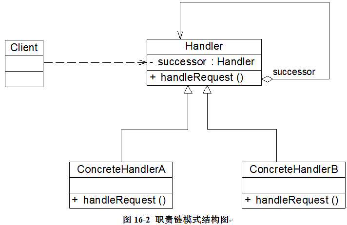
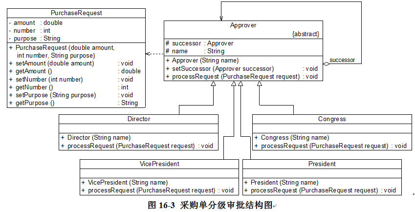

> 【学习难度：★★★☆☆，使用频率：★★☆☆☆】    
>  直接出处：[职责链模式](http://woquanke.com/books/gof/%E8%81%8C%E8%B4%A3%E9%93%BE%E6%A8%A1%E5%BC%8F-Chain%20of%20Responsibility%20Pattern.html)  
>  梳理和学习：https://github.com/BruceOuyang/boy-design-pattern  
>  简书日期： 2018/03/15  
>  简书首页：https://www.jianshu.com/p/0fb891a7c5ed  

## 请求的链式处理——职责链模式（一）

“一对二”，“过”，“过”……这声音熟悉吗？你会想到什么？对！纸牌。在类似“斗地主”这样的纸牌游戏中，某人出牌给他的下家，下家看看手中的牌，如果要不起上家的牌则将出牌请求再转发给他的下家，其下家再进行判断。一个循环下来，如果其他人都要不起该牌，则最初的出牌者可以打出新的牌。在这个过程中，牌作为一个请求沿着一条链在传递，每一位纸牌的玩家都可以处理该请求。在设计模式中，我们也有一种专门用于处理这种请求链式传递的模式，它就是本章将要介绍的职责链模式。

16.1 采购单的分级审批

Sunny软件公司承接了某企业SCM(Supply Chain Management，供应链管理)系统的开发任务，其中包含一个采购审批子系统。该企业的采购审批是分级进行的，即根据采购金额的不同由不同层次的主管人员来审批，主任可以审批5万元以下（不包括5万元）的采购单，副董事长可以审批5万元至10万元（不包括10万元）的采购单，董事长可以审批10万元至50万元（不包括50万元）的采购单，50万元及以上的采购单就需要开董事会讨论决定。如图16-1所示：  
  

如何在软件中实现采购单的分级审批？Sunny软件公司开发人员提出了一个初始解决方案，在系统中提供一个采购单处理类PurchaseRequestHandler用于统一处理采购单，其框架代码如下所示：  
```java
//采购单处理类  
class PurchaseRequestHandler {  
    //递交采购单给主任  
    public void sendRequestToDirector(PurchaseRequest request) {  
        if (request.getAmount() < 50000) {  
            //主任可审批该采购单  
            this.handleByDirector(request);  
        }  
        else if (request.getAmount() < 100000) {  
            //副董事长可审批该采购单  
            this.handleByVicePresident(request);  
        }  
        else if (request.getAmount() < 500000) {  
            //董事长可审批该采购单  
            this.handleByPresident(request);  
        }  
        else {  
            //董事会可审批该采购单  
            this.handleByCongress(request);  
        }  
    }  

    //主任审批采购单  
    public void handleByDirector(PurchaseRequest request) {  
        //代码省略  
    }  

    //副董事长审批采购单  
    public void handleByVicePresident(PurchaseRequest request) {  
        //代码省略  
    }  

    //董事长审批采购单  
    public void handleByPresident(PurchaseRequest request) {  
        //代码省略  
    }  

    //董事会审批采购单  
    public void handleByCongress(PurchaseRequest request) {  
        //代码省略  
    }  
}
```  

问题貌似很简单，但仔细分析，发现上述方案存在如下几个问题：  

(1)PurchaseRequestHandler类较为庞大，各个级别的审批方法都集中在一个类中，违反了“单一职责原则”，测试和维护难度大。  

(2)如果需要增加一个新的审批级别或调整任何一级的审批金额和审批细节（例如将董事长的审批额度改为60万元）时都必须修改源代码并进行严格测试，此外，如果需要移除某一级别（例如金额为10万元及以上的采购单直接由董事长审批，不再设副董事长一职）时也必须对源代码进行修改，违反了“开闭原则”。  

(3)审批流程的设置缺乏灵活性，现在的审批流程是“主任-->副董事长-->董事长-->董事会”，如果需要改为“主任-->董事长-->董事会”，在此方案中只能通过修改源代码来实现，客户端无法定制审批流程。  

如何针对上述问题对系统进行改进？Sunny公司开发人员迫切需要一种新的设计方案，还好有职责链模式，通过使用职责链模式我们可以最大程度地解决这些问题，下面让我们正式进入职责链模式的学习。  

## 请求的链式处理——职责链模式（二）

16.2 职责链模式概述  

很多情况下，在一个软件系统中可以处理某个请求的对象不止一个，例如SCM系统中的采购单审批，主任、副董事长、董事长和董事会都可以处理采购单，他们可以构成一条处理采购单的链式结构，采购单沿着这条链进行传递，这条链就称为职责链。职责链可以是一条直线、一个环或者一个树形结构，最常见的职责链是直线型，即沿着一条单向的链来传递请求。链上的每一个对象都是请求处理者，职责链模式可以将请求的处理者组织成一条链，并让请求沿着链传递，由链上的处理者对请求进行相应的处理，客户端无须关心请求的处理细节以及请求的传递，只需将请求发送到链上即可，实现请求发送者和请求处理者解耦。

职责链模式定义如下： 职责链模式(Chain of Responsibility Pattern)：避免请求发送者与接收者耦合在一起，让多个对象都有可能接收请求，将这些对象连接成一条链，并且沿着这条链传递请求，直到有对象处理它为止。职责链模式是一种对象行为型模式。

职责链模式结构的核心在于引入了一个抽象处理者。职责链模式结构如图16-2所示：  
  

在职责链模式结构图中包含如下几个角色：  

* Handler（抽象处理者）：它定义了一个处理请求的接口，一般设计为抽象类，由于不同的具体处理者处理请求的方式不同，因此在其中定义了抽象请求处理方法。因为每一个处理者的下家还是一个处理者，因此在抽象处理者中定义了一个抽象处理者类型的对象（如结构图中的successor），作为其对下家的引用。通过该引用，处理者可以连成一条链。  

* ConcreteHandler（具体处理者）：它是抽象处理者的子类，可以处理用户请求，在具体处理者类中实现了抽象处理者中定义的抽象请求处理方法，在处理请求之前需要进行判断，看是否有相应的处理权限，如果可以处理请求就处理它，否则将请求转发给后继者；在具体处理者中可以访问链中下一个对象，以便请求的转发。  

在职责链模式里，很多对象由每一个对象对其下家的引用而连接起来形成一条链。请求在这个链上传递，直到链上的某一个对象决定处理此请求。发出这个请求的客户端并不知道链上的哪一个对象最终处理这个请求，这使得系统可以在不影响客户端的情况下动态地重新组织链和分配责任。

职责链模式的核心在于抽象处理者类的设计，抽象处理者的典型代码如下所示：  
```java
abstract class Handler {
    
    /**
     * 维持对下家的引用
     */  
    protected Handler successor;  

    public void setSuccessor(Handler successor) {  
        this.successor=successor;  
    }  

    public abstract void handleRequest(String request);  
}
```

上述代码中，抽象处理者类定义了对下家的引用对象，以便将请求转发给下家，该对象的访问符可设为protected，在其子类中可以使用。在抽象处理者类中声明了抽象的请求处理方法，具体实现交由子类完成。

具体处理者是抽象处理者的子类，它具有两大作用：第一是处理请求，不同的具体处理者以不同的形式实现抽象请求处理方法handleRequest()；第二是转发请求，如果该请求超出了当前处理者类的权限，可以将该请求转发给下家。具体处理者类的典型代码如下：  
```java
class ConcreteHandler extends Handler {  
    public void handleRequest(String request) {  
        if (请求满足条件) {  
            //处理请求  
        }  
        else {  
            this.successor.handleRequest(request);  //转发请求  
        }  
    }  
}
```

在具体处理类中通过对请求进行判断可以做出相应的处理。

需要注意的是，职责链模式并不创建职责链，职责链的创建工作必须由系统的其他部分来完成，一般是在使用该职责链的客户端中创建职责链。职责链模式降低了请求的发送端和接收端之间的耦合，使多个对象都有机会处理这个请求。  

**思考**
> 如何在客户端创建一条职责链？

## 请求的链式处理——职责链模式（三）

16.3 完整解决方案  

为了让采购单的审批流程更加灵活，并实现采购单的链式传递和处理，Sunny公司开发人员使用职责链模式来实现采购单的分级审批，其基本结构如图16-3所示：  
  

在图16-3中，抽象类Approver充当抽象处理者（抽象传递者），Director、VicePresident、President和Congress充当具体处理者（具体传递者），PurchaseRequest充当请求类。完整代码如下所示：  
```java
//采购单：请求类  
class PurchaseRequest {  
    private double amount;  //采购金额  
    private int number;  //采购单编号  
    private String purpose;  //采购目的  

    public PurchaseRequest(double amount, int number, String purpose) {  
        this.amount = amount;  
        this.number = number;  
        this.purpose = purpose;  
    }  

    public void setAmount(double amount) {  
        this.amount = amount;  
    }  

    public double getAmount() {  
        return this.amount;  
    }  

    public void setNumber(int number) {  
        this.number = number;  
    }  

    public int getNumber() {  
        return this.number;  
    }  

    public void setPurpose(String purpose) {  
        this.purpose = purpose;  
    }  

    public String getPurpose() {  
        return this.purpose;  
    }  
}  

//审批者类：抽象处理者  
abstract class Approver {  
    protected Approver successor; //定义后继对象  
    protected String name; //审批者姓名  

    public Approver(String name) {  
        this.name = name;  
    }  

    //设置后继者  
    public void setSuccessor(Approver successor) {   
        this.successor = successor;  
    }  

    //抽象请求处理方法  
    public abstract void processRequest(PurchaseRequest request);  
}  

//主任类：具体处理者  
class Director extends Approver {  
    public Director(String name) {  
        super(name);  
    }  

    //具体请求处理方法  
    public void processRequest(PurchaseRequest request) {  
        if (request.getAmount() < 50000) {  
            System.out.println("主任" + this.name + "审批采购单：" + request.getNumber() + "，金额：" + request.getAmount() + "元，采购目的：" + request.getPurpose() + "。");  //处理请求  
        }  
        else {  
            this.successor.processRequest(request);  //转发请求  
        }     
    }  
}  

//副董事长类：具体处理者  
class VicePresident extends Approver {  
    public VicePresident(String name) {  
        super(name);  
    }  

    //具体请求处理方法  
    public void processRequest(PurchaseRequest request) {  
        if (request.getAmount() < 100000) {  
            System.out.println("副董事长" + this.name + "审批采购单：" + request.getNumber() + "，金额：" + request.getAmount() + "元，采购目的：" + request.getPurpose() + "。");  //处理请求  
        }  
        else {  
            this.successor.processRequest(request);  //转发请求  
        }     
    }  
}  

//董事长类：具体处理者  
class President extends Approver {  
    public President(String name) {  
        super(name);  
    }  

    //具体请求处理方法  
    public void processRequest(PurchaseRequest request) {  
        if (request.getAmount() < 500000) {  
            System.out.println("董事长" + this.name + "审批采购单：" + request.getNumber() + "，金额：" + request.getAmount() + "元，采购目的：" + request.getPurpose() + "。");  //处理请求  
        }  
        else {  
            this.successor.processRequest(request);  //转发请求  
        }  
    }  
}  

//董事会类：具体处理者  
class Congress extends Approver {  
    public Congress(String name) {  
        super(name);  
    }  

    //具体请求处理方法  
    public void processRequest(PurchaseRequest request) {  
        System.out.println("召开董事会审批采购单：" + request.getNumber() + "，金额：" + request.getAmount() + "元，采购目的：" + request.getPurpose() + "。");        //处理请求  
    }      
}
```

编写如下客户端测试代码：
```java
class Client {  
    public static void main(String[] args) {  
        Approver wjzhang,gyang,jguo,meeting;  
        wjzhang = new Director("张无忌");  
        gyang = new VicePresident("杨过");  
        jguo = new President("郭靖");  
        meeting = new Congress("董事会");  

        //创建职责链  
        wjzhang.setSuccessor(gyang);  
        gyang.setSuccessor(jguo);  
        jguo.setSuccessor(meeting);  

        //创建采购单  
        PurchaseRequest pr1 = new PurchaseRequest(45000,10001,"购买倚天剑");  
        wjzhang.processRequest(pr1);  

        PurchaseRequest pr2 = new PurchaseRequest(60000,10002,"购买《葵花宝典》");  
        wjzhang.processRequest(pr2);  

        PurchaseRequest pr3 = new PurchaseRequest(160000,10003,"购买《金刚经》");  
        wjzhang.processRequest(pr3);  

        PurchaseRequest pr4 = new PurchaseRequest(800000,10004,"购买桃花岛");  
        wjzhang.processRequest(pr4);  
    }  
}
```

编译并运行程序，输出结果如下：  
```
主任张无忌审批采购单：10001，金额：45000.0元，采购目的：购买倚天剑。
副董事长杨过审批采购单：10002，金额：60000.0元，采购目的：购买《葵花宝典》。
董事长郭靖审批采购单：10003，金额：160000.0元，采购目的：购买《金刚经》。
召开董事会审批采购单：10004，金额：800000.0元，采购目的：购买桃花岛。
```

如果需要在系统增加一个新的具体处理者，如增加一个经理(Manager)角色可以审批5万元至8万元（不包括8万元）的采购单，需要编写一个新的具体处理者类Manager，作为抽象处理者类Approver的子类，实现在Approver类中定义的抽象处理方法，如果采购金额大于等于8万元，则将请求转发给下家，代码如下所示：  
```java
//经理类：具体处理者  
class Manager extends Approver {  
    public Manager(String name) {  
        super(name);  
    }  

    //具体请求处理方法  
    public void processRequest(PurchaseRequest request) {  
        if (request.getAmount() < 80000) {  
            System.out.println("经理" + this.name + "审批采购单：" + request.getNumber() + "，金额：" + request.getAmount() + "元，采购目的：" + request.getPurpose() + "。");  //处理请求  
        }  
        else {  
            this.successor.processRequest(request);  //转发请求  
        }     
    }  
}
```  

由于链的创建过程由客户端负责，因此增加新的具体处理者类对原有类库无任何影响，无须修改已有类的源代码，符合“开闭原则”。

在客户端代码中，如果要将新的具体请求处理者应用在系统中，需要创建新的具体处理者对象，然后将该对象加入职责链中。如在客户端测试代码中增加如下代码：  
```java
Approver rhuang;  
rhuang = new Manager("黄蓉");
```

将建链代码改为：  
```java
//创建职责链

//将“黄蓉”作为“张无忌”的下家
wjzhang.setSuccessor(rhuang);

//将“杨过”作为“黄蓉”的下家
rhuang.setSuccessor(gyang); 
gyang.setSuccessor(jguo);
jguo.setSuccessor(meeting);
```

重新编译并运行程序，输出结果如下：  
```
主任张无忌审批采购单：10001，金额：45000.0元，采购目的：购买倚天剑。 
经理黄蓉审批采购单：10002，金额：60000.0元，采购目的：购买《葵花宝典》。
董事长郭靖审批采购单：10003，金额：160000.0元，采购目的：购买《金刚经》。 
召开董事会审批采购单：10004，金额：800000.0元，采购目的：购买桃花岛。
```

**思考**  
> 如果将审批流程由“主任-->副董事长-->董事长-->董事会”调整为“主任-->董事长-->董事会”，系统将做出哪些改动？预测修改之后客户端代码的输出结果。

## 请求的链式处理——职责链模式（四）

16.4 纯与不纯的职责链模式  

职责链模式可分为纯的职责链模式和不纯的职责链模式两种：

(1) 纯的职责链模式

一个纯的职责链模式要求一个具体处理者对象只能在两个行为中选择一个：要么承担全部责任，要么将责任推给下家，不允许出现某一个具体处理者对象在承担了一部分或全部责任后又将责任向下传递的情况。而且在纯的职责链模式中，要求一个请求必须被某一个处理者对象所接收，不能出现某个请求未被任何一个处理者对象处理的情况。在前面的采购单审批实例中应用的是纯的职责链模式。

(2)不纯的职责链模式

在一个不纯的职责链模式中允许某个请求被一个具体处理者部分处理后再向下传递，或者一个具体处理者处理完某请求后其后继处理者可以继续处理该请求，而且一个请求可以最终不被任何处理者对象所接收。Java AWT 1.0中的事件处理模型应用的是不纯的职责链模式，其基本原理如下：由于窗口组件（如按钮、文本框等）一般都位于容器组件中，因此当事件发生在某一个组件上时，先通过组件对象的handleEvent()方法将事件传递给相应的事件处理方法，该事件处理方法将处理此事件，然后决定是否将该事件向上一级容器组件传播；上级容器组件在接到事件之后可以继续处理此事件并决定是否继续向上级容器组件传播，如此反复，直到事件到达顶层容器组件为止；如果一直传到最顶层容器仍没有处理方法，则该事件不予处理。每一级组件在接收到事件时，都可以处理此事件，而不论此事件是否在上一级已得到处理，还存在事件未被处理的情况。显然，这就是不纯的职责链模式，早期的Java AWT事件模型(JDK 1.0及更早)中的这种事件处理机制又叫事件浮升(Event Bubbling)机制。从Java.1.1以后，JDK使用观察者模式代替职责链模式来处理事件。目前，在JavaScript中仍然可以使用这种事件浮升机制来进行事件处理。

16.5 职责链模式总结

职责链模式通过建立一条链来组织请求的处理者，请求将沿着链进行传递，请求发送者无须知道请求在何时、何处以及如何被处理，实现了请求发送者与处理者的解耦。在软件开发中，如果遇到有多个对象可以处理同一请求时可以应用职责链模式，例如在Web应用开发中创建一个过滤器(Filter)链来对请求数据进行过滤，在工作流系统中实现公文的分级审批等等，使用职责链模式可以较好地解决此类问题。

1.主要优点

职责链模式的主要优点如下：  

(1) 职责链模式使得一个对象无须知道是其他哪一个对象处理其请求，对象仅需知道该请求会被处理即可，接收者和发送者都没有对方的明确信息，且链中的对象不需要知道链的结构，由客户端负责链的创建，降低了系统的耦合度。  

(2) 请求处理对象仅需维持一个指向其后继者的引用，而不需要维持它对所有的候选处理者的引用，可简化对象的相互连接。  

(3) 在给对象分派职责时，职责链可以给我们更多的灵活性，可以通过在运行时对该链进行动态的增加或修改来增加或改变处理一个请求的职责。  

(4) 在系统中增加一个新的具体请求处理者时无须修改原有系统的代码，只需要在客户端重新建链即可，从这一点来看是符合“开闭原则”的。  

2.主要缺点  

职责链模式的主要缺点如下：  

(1) 由于一个请求没有明确的接收者，那么就不能保证它一定会被处理，该请求可能一直到链的末端都得不到处理；一个请求也可能因职责链没有被正确配置而得不到处理。  

(2) 对于比较长的职责链，请求的处理可能涉及到多个处理对象，系统性能将受到一定影响，而且在进行代码调试时不太方便。  

(3) 如果建链不当，可能会造成循环调用，将导致系统陷入死循环。  

3.适用场景  

在以下情况下可以考虑使用职责链模式：  

(1) 有多个对象可以处理同一个请求，具体哪个对象处理该请求待运行时刻再确定，客户端只需将请求提交到链上，而无须关心请求的处理对象是谁以及它是如何处理的。  

(2) 在不明确指定接收者的情况下，向多个对象中的一个提交一个请求。  

(3) 可动态指定一组对象处理请求，客户端可以动态创建职责链来处理请求，还可以改变链中处理者之间的先后次序。  

**练习**  
> Sunny软件公司的OA系统需要提供一个假条审批模块：如果员工请假天数小于3天，主任可以审批该假条；如果员工请假天数大于等于3天，小于10天，经理可以审批；如果员工请假天数大于等于10天，小于30天，总经理可以审批；如果超过30天，总经理也不能审批，提示相应的拒绝信息。试用职责链模式设计该假条审批模块。

> 练习会在[我的github](https://github.com/BruceOuyang/boy-design-pattern)上做掉

### 最后 <!--{docsify-ignore}-->
如果你喜欢老欧整理的文章，欢迎你关注我的微信公众号，老欧的issueList站点文章更新时，会同步推送到微信公众号。
