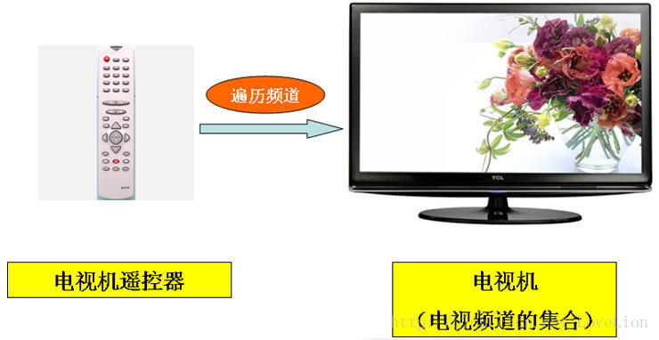
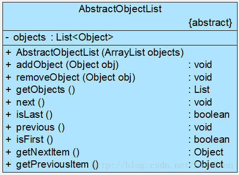
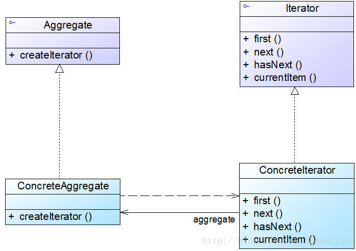
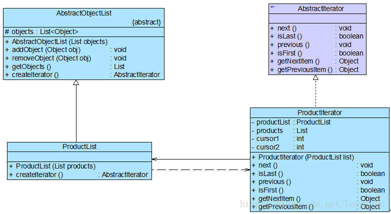
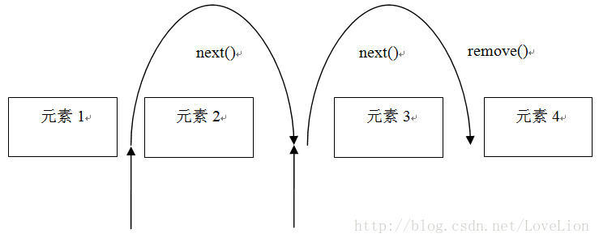

> 【学习难度：★★★☆☆，使用频率：★★★★★】  
>  直接出处：[迭代器模式](http://woquanke.com/books/gof/%E8%BF%AD%E4%BB%A3%E5%99%A8%E6%A8%A1%E5%BC%8F-Iterator%20Pattern.html)  
>  梳理和学习：https://github.com/BruceOuyang/boy-design-pattern  
>  简书日期： 2018/03/22  
>  简书首页：https://www.jianshu.com/p/0fb891a7c5ed  

## 遍历聚合对象中的元素——迭代器模式（一）

20世纪80年代，那时我家有一台“古老的”电视机，牌子我忘了，只记得是台黑白电视机，没有遥控器，每次开关机或者换台都需要通过电视机上面的那些按钮来完成，我印象最深的是那个用来换台的按钮，需要亲自用手去旋转（还要使点劲才能拧动），每转一下就“啪”的响一声，如果没有收到任何电视频道就会出现一片让人眼花的雪花点。当然，电视机上面那两根可以前后左右移动，并能够变长变短的天线也是当年电视机的标志性部件之一，我记得小时候每次画电视机时一定要画那两根天线，要不总觉得不是电视机。随着科技的飞速发展，越来越高级的电视机相继出现，那种古老的电视机已经很少能够看到了。与那时的电视机相比，现今的电视机给我们带来的最大便利之一就是增加了电视机遥控器，我们在进行开机、关机、换台、改变音量等操作时都无须直接操作电视机，可以通过遥控器来间接实现。我们可以将电视机看成一个存储电视频道的集合对象，通过遥控器可以对电视机中的电视频道集合进行操作，如返回上一个频道、跳转到下一个频道或者跳转至指定的频道。遥控器为我们操作电视频道带来很大的方便，用户并不需要知道这些频道到底如何存储在电视机中。电视机遥控器和电视机示意图如图1所示：  
  

在软件开发中，也存在大量类似电视机一样的类，它们可以存储多个成员对象（元素），这些类通常称为聚合类(Aggregate Classes)，对应的对象称为聚合对象。为了更加方便地操作这些聚合对象，同时可以很灵活地为聚合对象增加不同的遍历方法，我们也需要类似电视机遥控器一样的角色，可以访问一个聚合对象中的元素但又不需要暴露它的内部结构。本章我们将要学习的迭代器模式将为聚合对象提供一个遥控器，通过引入迭代器，客户端无须了解聚合对象的内部结构即可实现对聚合对象中成员的遍历，还可以根据需要很方便地增加新的遍历方式。  

1 销售管理系统中数据的遍历  

Sunny软件公司为某商场开发了一套销售管理系统，在对该系统进行分析和设计时，Sunny软件公司开发人员发现经常需要对系统中的商品数据、客户数据等进行遍历，为了复用这些遍历代码，Sunny公司开发人员设计了一个抽象的数据集合类AbstractObjectList，而将存储商品和客户等数据的类作为其子类，AbstractObjectList类结构如图2所示：  
  

在图2中，List类型的对象objects用于存储数据，方法说明如表1所示： 表1 AbstractObjectList类方法说明  
  

AbstractObjectList类的子类ProductList和CustomerList分别用于存储商品数据和客户数据。

Sunny软件公司开发人员通过对AbstractObjectList类结构进行分析，发现该设计方案存在如下几个问题：

(1) 在图2所示类图中，addObject()、removeObject()等方法用于管理数据，而next()、isLast()、previous()、isFirst()等方法用于遍历数据。这将导致聚合类的职责过重，它既负责存储和管理数据，又负责遍历数据，违反了“单一职责原则”，由于聚合类非常庞大，实现代码过长，还将给测试和维护增加难度。

(2) 如果将抽象聚合类声明为一个接口，则在这个接口中充斥着大量方法，不利于子类实现，违反了“接口隔离原则”。

(3) 如果将所有的遍历操作都交给子类来实现，将导致子类代码庞大，而且必须暴露AbstractObjectList的内部存储细节，向子类公开自己的私有属性，否则子类无法实施对数据的遍历，这将破坏AbstractObjectList类的封装性。

如何解决上述问题？解决方案之一就是将聚合类中负责遍历数据的方法提取出来，封装到专门的类中，实现数据存储和数据遍历分离，无须暴露聚合类的内部属性即可对其进行操作，而这正是迭代器模式的意图所在。

## 遍历聚合对象中的元素——迭代器模式（二）

2 迭代器模式概述

在软件开发中，我们经常需要使用聚合对象来存储一系列数据。聚合对象拥有两个职责：一是存储数据；二是遍历数据。从依赖性来看，前者是聚合对象的基本职责；而后者既是可变化的，又是可分离的。因此，可以将遍历数据的行为从聚合对象中分离出来，封装在一个被称之为“迭代器”的对象中，由迭代器来提供遍历聚合对象内部数据的行为，这将简化聚合对象的设计，更符合“单一职责原则”的要求。

迭代器模式定义如下：

迭代器模式(Iterator Pattern)：提供一种方法来访问聚合对象，而不用暴露这个对象的内部表示，其别名为游标(Cursor)。迭代器模式是一种对象行为型模式。

在迭代器模式结构中包含聚合和迭代器两个层次结构，考虑到系统的灵活性和可扩展性，在迭代器模式中应用了工厂方法模式，其模式结构如图3所示：  
  

在迭代器模式结构图中包含如下几个角色：

* Iterator（抽象迭代器）：它定义了访问和遍历元素的接口，声明了用于遍历数据元素的方法，例如：用于获取第一个元素的first()方法，用于访问下一个元素的next()方法，用于判断是否还有下一个元素的hasNext()方法，用于获取当前元素的currentItem()方法等，在具体迭代器中将实现这些方法。

* ConcreteIterator（具体迭代器）：它实现了抽象迭代器接口，完成对聚合对象的遍历，同时在具体迭代器中通过游标来记录在聚合对象中所处的当前位置，在具体实现时，游标通常是一个表示位置的非负整数。

* Aggregate（抽象聚合类）：它用于存储和管理元素对象，声明一个createIterator()方法用于创建一个迭代器对象，充当抽象迭代器工厂角色。

* ConcreteAggregate（具体聚合类）：它实现了在抽象聚合类中声明的createIterator()方法，该方法返回一个与该具体聚合类对应的具体迭代器ConcreteIterator实例。

在迭代器模式中，提供了一个外部的迭代器来对聚合对象进行访问和遍历，迭代器定义了一个访问该聚合元素的接口，并且可以跟踪当前遍历的元素，了解哪些元素已经遍历过而哪些没有。迭代器的引入，将使得对一个复杂聚合对象的操作变得简单。

下面我们结合代码来对迭代器模式的结构进行进一步分析。在迭代器模式中应用了工厂方法模式，抽象迭代器对应于抽象产品角色，具体迭代器对应于具体产品角色，抽象聚合类对应于抽象工厂角色，具体聚合类对应于具体工厂角色。

在抽象迭代器中声明了用于遍历聚合对象中所存储元素的方法，典型代码如下所示：  
```java
interface Iterator {  
    void first(); //将游标指向第一个元素  
    void next(); //将游标指向下一个元素  
    boolean hasNext(); //判断是否存在下一个元素  
    Object currentItem(); //获取游标指向的当前元素  
}
```

在具体迭代器中将实现抽象迭代器声明的遍历数据的方法，如下代码所示：  
```java
class ConcreteIterator implements Iterator {  
    
    //维持一个对具体聚合对象的引用，以便于访问存储在聚合对象中的数据
    private ConcreteAggregate objects; 
    
    //定义一个游标，用于记录当前访问位置 
    private int cursor; 
    
    public ConcreteIterator(ConcreteAggregate objects) {  
        this.objects=objects;  
    }  

    public void first() {  ......  }  

    public void next() {  ......  }  

    public boolean hasNext() {  ......  }  

    public Object currentItem() {  ......  }  
}
```

需要注意的是抽象迭代器接口的设计非常重要，一方面需要充分满足各种遍历操作的要求，尽量为各种遍历方法都提供声明，另一方面又不能包含太多方法，接口中方法太多将给子类的实现带来麻烦。因此，可以考虑使用抽象类来设计抽象迭代器，在抽象类中为每一个方法提供一个空的默认实现。如果需要在具体迭代器中为聚合对象增加全新的遍历操作，则必须修改抽象迭代器和具体迭代器的源代码，这将违反“开闭原则”，因此在设计时要考虑全面，避免之后修改接口。

聚合类用于存储数据并负责创建迭代器对象，最简单的抽象聚合类代码如下所示：  
```java
interface Aggregate {  
    Iterator createIterator();  
}
```

具体聚合类作为抽象聚合类的子类，一方面负责存储数据，另一方面实现了在抽象聚合类中声明的工厂方法createIterator()，用于返回一个与该具体聚合类对应的具体迭代器对象，代码如下所示：
```java
class ConcreteAggregate implements Aggregate {    
    ......    
    public Iterator createIterator() {  
        return new ConcreteIterator(this);  
    }  
    ......  
}
```

**思考**
> 理解迭代器模式中具体聚合类与具体迭代器类之间存在的依赖关系和关联关系。

## 遍历聚合对象中的元素——迭代器模式（三）

3 完整解决方案

为了简化AbstractObjectList类的结构，并给不同的具体数据集合类提供不同的遍历方式，Sunny软件公司开发人员使用迭代器模式来重构AbstractObjectList类的设计，重构之后的销售管理系统数据遍历结构如图4所示：  
  

（注：为了简化类图和代码，本结构图中只提供一个具体聚合类和具体迭代器类）

在图4中，AbstractObjectList充当抽象聚合类，ProductList充当具体聚合类，AbstractIterator充当抽象迭代器，ProductIterator充当具体迭代器。完整代码如下所示：  
```java
//在本实例中，为了详细说明自定义迭代器的实现过程，我们没有使用JDK中内置的迭代器，事实上，JDK内置迭代器已经实现了对一个List对象的正向遍历  
import java.util.*;  

//抽象聚合类  
abstract class AbstractObjectList {  
    protected List<Object> objects = new ArrayList<Object>();  

    public AbstractObjectList(List objects) {  
        this.objects = objects;  
    }  

    public void addObject(Object obj) {  
        this.objects.add(obj);  
    }  

    public void removeObject(Object obj) {  
        this.objects.remove(obj);  
    }  

    public List getObjects() {  
        return this.objects;  
    }  

    //声明创建迭代器对象的抽象工厂方法  
    public abstract AbstractIterator createIterator();  
}  

//商品数据类：具体聚合类  
class ProductList extends AbstractObjectList {  
    public ProductList(List products) {  
        super(products);  
    }  

    //实现创建迭代器对象的具体工厂方法  
    public AbstractIterator createIterator() {  
        return new ProductIterator(this);  
    }  
}   

//抽象迭代器  
interface AbstractIterator {  
    public void next(); //移至下一个元素  
    public boolean isLast(); //判断是否为最后一个元素  
    public void previous(); //移至上一个元素  
    public boolean isFirst(); //判断是否为第一个元素  
    public Object getNextItem(); //获取下一个元素  
    public Object getPreviousItem(); //获取上一个元素  
}  

//商品迭代器：具体迭代器  
class ProductIterator implements AbstractIterator {  
    private ProductList productList;  
    private List products;  
    private int cursor1; //定义一个游标，用于记录正向遍历的位置  
    private int cursor2; //定义一个游标，用于记录逆向遍历的位置  

    public ProductIterator(ProductList list) {  
        this.productList = list;  
        this.products = list.getObjects(); //获取集合对象  
        cursor1 = 0; //设置正向遍历游标的初始值  
        cursor2 = products.size() -1; //设置逆向遍历游标的初始值  
    }  

    public void next() {  
        if(cursor1 < products.size()) {  
            cursor1++;  
        }  
    }  

    public boolean isLast() {  
        return (cursor1 == products.size());  
    }  

    public void previous() {  
        if (cursor2 > -1) {  
            cursor2--;  
        }  
    }  

    public boolean isFirst() {  
        return (cursor2 == -1);  
    }  

    public Object getNextItem() {  
        return products.get(cursor1);  
    }   

    public Object getPreviousItem() {  
        return products.get(cursor2);  
    }     
}
```

编写如下客户端测试代码：
```java
class Client {  
    public static void main(String args[]) {  
        List products = new ArrayList();  
        products.add("倚天剑");  
        products.add("屠龙刀");  
        products.add("断肠草");  
        products.add("葵花宝典");  
        products.add("四十二章经");  

        AbstractObjectList list;  
        AbstractIterator iterator;  

        list = new ProductList(products); //创建聚合对象  
        iterator = list.createIterator();   //创建迭代器对象  

        System.out.println("正向遍历：");      
        while(!iterator.isLast()) {  
            System.out.print(iterator.getNextItem() + "，");  
            iterator.next();  
        }  
        System.out.println();  
        System.out.println("-----------------------------");  
        System.out.println("逆向遍历：");  
        while(!iterator.isFirst()) {  
            System.out.print(iterator.getPreviousItem() + "，");  
            iterator.previous();  
        }  
    }  
}
```  

编译并运行程序，输出结果如下：
```
正向遍历：
倚天剑，屠龙刀，断肠草，葵花宝典，四十二章经，
-----------------------------
逆向遍历：
四十二章经，葵花宝典，断肠草，屠龙刀，倚天剑，
```

如果需要增加一个新的具体聚合类，如客户数据集合类，并且需要为客户数据集合类提供不同于商品数据集合类的正向遍历和逆向遍历操作，只需增加一个新的聚合子类和一个新的具体迭代器类即可，原有类库代码无须修改，符合“开闭原则”；如果需要为ProductList类更换一个迭代器，只需要增加一个新的具体迭代器类作为抽象迭代器类的子类，重新实现遍历方法，原有迭代器代码无须修改，也符合“开闭原则”；但是如果要在迭代器中增加新的方法，则需要修改抽象迭代器源代码，这将违背“开闭原则”。

## 遍历聚合对象中的元素——迭代器模式（四）

4 使用内部类实现迭代器

在迭代器模式结构图中，我们可以看到具体迭代器类和具体聚合类之间存在双重关系，其中一个关系为关联关系，在具体迭代器中需要维持一个对具体聚合对象的引用，该关联关系的目的是访问存储在聚合对象中的数据，以便迭代器能够对这些数据进行遍历操作。

除了使用关联关系外，为了能够让迭代器可以访问到聚合对象中的数据，我们还可以将迭代器类设计为聚合类的内部类，JDK中的迭代器类就是通过这种方法来实现的，如下AbstractList类代码片段所示：  
```java
package java.util;  
……  
public abstract class AbstractList<E> extends AbstractCollection<E> implements List<E> {  
    ......  
    private class Itr implements Iterator<E> {  
        int cursor = 0;  
        ......  
}  
……  
}
```

我们可以通过类似的方法来设计第3节中的ProductList类，将ProductIterator类作为ProductList类的内部类，代码如下所示：  
```java
//商品数据类：具体聚合类  
class ProductList extends AbstractObjectList {  
    public ProductList(List products) {  
        super(products);  
    }  

    public AbstractIterator createIterator() {  
        return new ProductIterator();  
    }  

    //商品迭代器：具体迭代器，内部类实现  
    private class ProductIterator implements AbstractIterator {  
        private int cursor1;  
        private int cursor2;  

        public ProductIterator() {  
            cursor1 = 0;  
            cursor2 = objects.size() -1;  
        }  

        public void next() {  
            if(cursor1 < objects.size()) {  
                cursor1++;  
            }  
        }  

        public boolean isLast() {  
            return (cursor1 == objects.size());  
        }  

        public void previous() {  
            if(cursor2 > -1) {  
                cursor2--;  
            }  
        }  

        public boolean isFirst() {  
            return (cursor2 == -1);  
        }  

        public Object getNextItem() {  
            return objects.get(cursor1);  
        }   

        public Object getPreviousItem() {  
            return objects.get(cursor2);  
        }     
    }  
}
```

无论使用哪种实现机制，客户端代码都是一样的，也就是说客户端无须关心具体迭代器对象的创建细节，只需通过调用工厂方法createIterator()即可得到一个可用的迭代器对象，这也是使用工厂方法模式的好处，通过工厂来封装对象的创建过程，简化了客户端的调用。

## 遍历聚合对象中的元素——迭代器模式（五）

5 JDK内置迭代器

为了让开发人员能够更加方便地操作聚合对象，在Java、C#等编程语言中都提供了内置迭代器。在Java集合框架中，常用的List和Set等聚合类都继承（或实现）了java.util.Collection接口，在Collection接口中声明了如下方法（部分）：
```java
package java.util;  

public interface Collection<E> extends Iterable<E> {  
    ……  
    boolean add(Object c);  
    boolean addAll(Collection c);  
    boolean remove(Object o);  
    boolean removeAll(Collection c);  
    boolean remainAll(Collection c);   
    Iterator iterator();  
    ……  
}
```

除了包含一些增加元素和删除元素的方法外，还提供了一个iterator()方法，用于返回一个Iterator迭代器对象，以便遍历聚合中的元素；具体的Java聚合类可以通过实现该iterator()方法返回一个具体的Iterator对象。

JDK中定义了抽象迭代器接口Iterator，代码如下所示：
```java
package java.util;  

public interface Iterator<E> {  
    boolean hasNext();  
    E next();  
    void remove();  
}
```

其中，hasNext()用于判断聚合对象中是否还存在下一个元素，为了不抛出异常，在每次调用next()之前需先调用hasNext()，如果有可供访问的元素，则返回true；next()方法用于将游标移至下一个元素，通过它可以逐个访问聚合中的元素，它返回游标所越过的那个元素的引用；remove()方法用于删除上次调用next()时所返回的元素。

Java迭代器工作原理如图5所示，在第一个next()方法被调用时，迭代器游标由“元素1”与“元素2”之间移至“元素2”与“元素3”之间，跨越了“元素2”，因此next()方法将返回对“元素2”的引用；在第二个next()方法被调用时，迭代器由“元素2”与“元素3”之间移至“元素3”和“元素4”之间，next()方法将返回对“元素3”的引用，如果此时调用remove()方法，即可将“元素3”删除。  
  

如下代码片段可用于删除聚合对象中的第一个元素：
```java
Iterator iterator = collection.iterator();   //collection是已实例化的聚合对象  
iterator.next();        // 跳过第一个元素  
iterator.remove();  // 删除第一个元素
```

需要注意的是，在这里，next()方法与remove()方法的调用是相互关联的。如果调用remove()之前，没有先对next()进行调用，那么将会抛出一个IllegalStateException异常，因为没有任何可供删除的元素。 如下代码片段可用于删除两个相邻的元素：  
```java
iterator.remove();  
iterator.next();  //如果删除此行代码程序将抛异常  
iterator.remove();
```

在上面的代码片段中如果将代码iterator.next();去掉则程序运行抛异常，因为第二次删除时将找不到可供删除的元素。

在JDK中，Collection接口和Iterator接口充当了迭代器模式的抽象层，分别对应于抽象聚合类和抽象迭代器，而Collection接口的子类充当了具体聚合类，下面以List为例加以说明，图6列出了JDK中部分与List有关的类及它们之间的关系：  
  

（注：为了简化类图，本图省略了大量方法）

在JDK中，实际情况比图6要复杂很多，在图6中，List接口除了继承Collection接口的iterator()方法外，还增加了新的工厂方法listIterator()，专门用于创建ListIterator类型的迭代器，在List的子类LinkedList中实现了该方法，可用于创建具体的ListIterator子类ListItr的对象，代码如下所示：  
```java
public ListIterator<E> listIterator(int index) {  
    return new ListItr(index);  
}  
```

listIterator()方法用于返回具体迭代器ListItr类型的对象。在JDK源码中，AbstractList中的iterator()方法调用了listIterator()方法，如下代码所示：  
```java
public Iterator iterator() {
    return listIterator();
}
```

客户端通过调用LinkedList类的iterator()方法，即可得到一个专门用于遍历LinkedList的迭代器对象。

大家可能会问？既然有了iterator()方法，为什么还要提供一个listIterator()方法呢？这两个方法的功能不会存在重复吗？干嘛要多此一举？

这是一个好问题。我给大家简单解释一下为什么要这样设计：由于在Iterator接口中定义的方法太少，只有三个，通过这三个方法只能实现正向遍历，而有时候我们需要对一个聚合对象进行逆向遍历等操作，因此在JDK的ListIterator接口中声明了用于逆向遍历的hasPrevious()和previous()等方法，如果客户端需要调用这两个方法来实现逆向遍历，就不能再使用iterator()方法来创建迭代器了，因为此时创建的迭代器对象是不具有这两个方法的。我们只能通过如下代码来创建ListIterator类型的迭代器对象：  
```java
ListIterator i = c.listIterator();
```

正因为如此，在JDK的List接口中不得不增加对listIterator()方法的声明，该方法可以返回一个ListIterator类型的迭代器，ListIterator迭代器具有更加强大的功能。

**思考**  
> 为什么使用iterator()方法创建的迭代器无法实现逆向遍历？

在Java语言中，我们可以直接使用JDK内置的迭代器来遍历聚合对象中的元素，下面的代码演示了如何使用Java内置的迭代器：
```java
import java.util.*;

class IteratorDemo {
public static void process(Collection c) {
    Iterator i = c.iterator(); //创建迭代器对象

    //通过迭代器遍历聚合对象  
    while(i.hasNext()) {  
        System.out.println(i.next().toString());  
    }  
}

    public static void main(String args[]) {  
        Collection persons;  
        persons = new ArrayList(); //创建一个ArrayList类型的聚合对象
        persons.add("张无忌");
        persons.add("小龙女");
        persons.add("令狐冲");
        persons.add("韦小宝");
        persons.add("袁紫衣");
        persons.add("小龙女");
    
        process(persons);  
    }  
}
```

在静态方法process()中使用迭代器Iterator对Collection对象进行处理，该代码运行结果如下：  
```
张无忌 小龙女 令狐冲 韦小宝 袁紫衣 小龙女
```

如果需要更换聚合类型，如将List改成Set，则只需更换具体聚合类类名，如将上述代码中的ArrayList改为HashSet，则输出结果如下：  
```
令狐冲 张无忌 韦小宝 小龙女 袁紫衣
```

在HashSet中合并了重复元素，并且元素以随机次序输出，其结果与使用ArrayList不相同。由此可见，通过使用迭代器模式，使得更换具体聚合类变得非常方便，而且还可以根据需要增加新的聚合类，新的聚合类只需要实现Collection接口，无须修改原有类库代码，符合“开闭原则”。

**练习**
> 在Sunny软件公司开发的某教务管理系统中，一个班级(Class in School)包含多个学生(Student)，使用Java内置迭代器实现对学生信息的遍历，要求按学生年龄由大到小的次序输出学生信息。

## 遍历聚合对象中的元素——迭代器模式（六）

6 迭代器模式总结

迭代器模式是一种使用频率非常高的设计模式，通过引入迭代器可以将数据的遍历功能从聚合对象中分离出来，聚合对象只负责存储数据，而遍历数据由迭代器来完成。由于很多编程语言的类库都已经实现了迭代器模式，因此在实际开发中，我们只需要直接使用Java、C#等语言已定义好的迭代器即可，迭代器已经成为我们操作聚合对象的基本工具之一。

1. 主要优点

迭代器模式的主要优点如下：

(1) 它支持以不同的方式遍历一个聚合对象，在同一个聚合对象上可以定义多种遍历方式。在迭代器模式中只需要用一个不同的迭代器来替换原有迭代器即可改变遍历算法，我们也可以自己定义迭代器的子类以支持新的遍历方式。

(2) 迭代器简化了聚合类。由于引入了迭代器，在原有的聚合对象中不需要再自行提供数据遍历等方法，这样可以简化聚合类的设计。

(3) 在迭代器模式中，由于引入了抽象层，增加新的聚合类和迭代器类都很方便，无须修改原有代码，满足“开闭原则”的要求。

2. 主要缺点

迭代器模式的主要缺点如下：

(1) 由于迭代器模式将存储数据和遍历数据的职责分离，增加新的聚合类需要对应增加新的迭代器类，类的个数成对增加，这在一定程度上增加了系统的复杂性。

(2) 抽象迭代器的设计难度较大，需要充分考虑到系统将来的扩展，例如JDK内置迭代器Iterator就无法实现逆向遍历，如果需要实现逆向遍历，只能通过其子类ListIterator等来实现，而ListIterator迭代器无法用于操作Set类型的聚合对象。在自定义迭代器时，创建一个考虑全面的抽象迭代器并不是件很容易的事情。

3. 适用场景  

在以下情况下可以考虑使用迭代器模式：

(1) 访问一个聚合对象的内容而无须暴露它的内部表示。将聚合对象的访问与内部数据的存储分离，使得访问聚合对象时无须了解其内部实现细节。

(2) 需要为一个聚合对象提供多种遍历方式。

(3) 为遍历不同的聚合结构提供一个统一的接口，在该接口的实现类中为不同的聚合结构提供不同的遍历方式，而客户端可以一致性地操作该接口。

**练习**

> 设计一个逐页迭代器，每次可返回指定个数（一页）元素，并将该迭代器用于对数据进行分页处理。

> 练习会在[我的github](https://github.com/BruceOuyang/boy-design-pattern)上做掉

### 最后 <!--{docsify-ignore}-->
如果你喜欢老欧整理的文章，欢迎你关注我的微信公众号，老欧的issueList站点文章更新时，会同步推送到微信公众号。
