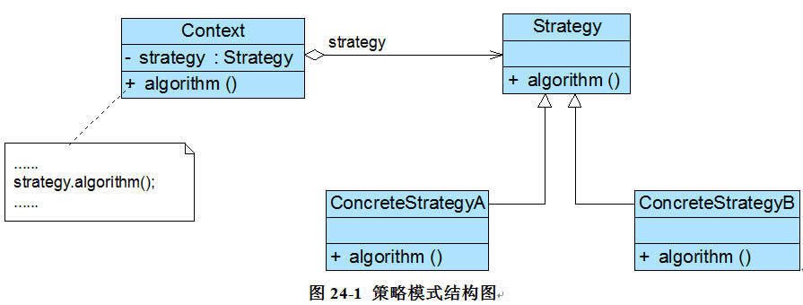

> 【学习难度：★☆☆☆☆，使用频率：★★★★☆】  
>  直接出处：[策略模式](http://woquanke.com/books/gof/%E7%AD%96%E7%95%A5%E6%A8%A1%E5%BC%8F-Strategy%20Pattern.html)  
>  梳理和学习：https://github.com/BruceOuyang/boy-design-pattern  
>  简书日期： 2018/03/30  
>  简书首页：https://www.jianshu.com/p/0fb891a7c5ed  

## 算法的封装与切换——策略模式（一）

俗话说：条条大路通罗马。在很多情况下，实现某个目标的途径不止一条，例如我们在外出旅游时可以选择多种不同的出行方式，如骑自行车、坐汽车、坐火车或者坐飞机，可根据实际情况（目的地、旅游预算、旅游时间等）来选择一种最适合的出行方式。在制订旅行计划时，如果目的地较远、时间不多，但不差钱，可以选择坐飞机去旅游；如果目的地虽远、但假期长、且需控制旅游成本时可以选择坐火车或汽车；如果从健康和环保的角度考虑，而且有足够的毅力，自行车游或者徒步旅游也是个不错的选择，大笑。

在软件开发中，我们也常常会遇到类似的情况，实现某一个功能有多条途径，每一条途径对应一种算法，此时我们可以使用一种设计模式来实现灵活地选择解决途径，也能够方便地增加新的解决途径。本章我们将介绍一种为了适应算法灵活性而产生的设计模式——策略模式。

24.1 电影票打折方案

Sunny软件公司为某电影院开发了一套影院售票系统，在该系统中需要为不同类型的用户提供不同的电影票打折方式，具体打折方案如下：

(1) 学生凭学生证可享受票价8折优惠；

(2) 年龄在10周岁及以下的儿童可享受每张票减免10元的优惠（原始票价需大于等于20元）；

(3) 影院VIP用户除享受票价半价优惠外还可进行积分，积分累计到一定额度可换取电影院赠送的奖品。

该系统在将来可能还要根据需要引入新的打折方式。

为了实现上述电影票打折功能，Sunny软件公司开发人员设计了一个电影票类MovieTicket，其核心代码片段如下所示：  
```java
//电影票类  
class MovieTicket {  
    private double price; //电影票价格  
    private String type; //电影票类型  

    public void setPrice(double price) {  
        this.price = price;  
    }  

    public void setType(String type) {  
        this.type = type;  
    }  

    public double getPrice() {  
        return this.calculate();  
    }  

         //计算打折之后的票价  
    public double calculate() {  
                  //学生票折后票价计算  
        if(this.type.equalsIgnoreCase("student")) {  
            System.out.println("学生票：");  
            return this.price * 0.8;  
        }  
                  //儿童票折后票价计算  
        else if(this.type.equalsIgnoreCase("children") && this.price >= 20 ) {  
            System.out.println("儿童票：");  
            return this.price - 10;  
        }  
                  //VIP票折后票价计算  
        else if(this.type.equalsIgnoreCase("vip")) {  
            System.out.println("VIP票：");  
            System.out.println("增加积分！");  
            return this.price * 0.5;  
        }  
        else {  
            return this.price; //如果不满足任何打折要求，则返回原始票价  
        }  
    }  
}
```

编写如下客户端测试代码：  
```java
class Client {  
    public static void main(String args[]) {  
        MovieTicket mt = new MovieTicket();  
        double originalPrice = 60.0; //原始票价  
        double currentPrice; //折后价  

        mt.setPrice(originalPrice);  
        System.out.println("原始价为：" + originalPrice);  
        System.out.println("---------------------------------");  

        mt.setType("student"); //学生票  
        currentPrice = mt.getPrice();  
        System.out.println("折后价为：" + currentPrice);  
        System.out.println("---------------------------------");  

        mt.setType("children"); //儿童票  
        currentPrice = mt.getPrice();  
        System.out.println("折后价为：" + currentPrice);  
    }  
}
```

编译并运行程序，输出结果如下所示：  
```
原始价为：60.0
---------------------------------
学生票：
折后价为：48.0
---------------------------------
儿童票：
折后价为：50.0
```

通过MovieTicket类实现了电影票的折后价计算，该方案解决了电影票打折问题，每一种打折方式都可以称为一种打折算法，更换打折方式只需修改客户端代码中的参数，无须修改已有源代码，但该方案并不是一个完美的解决方案，它至少存在如下三个问题：  

(1) MovieTicket类的calculate()方法非常庞大，它包含各种打折算法的实现代码，在代码中出现了较长的if…else…语句，不利于测试和维护。

(2) 增加新的打折算法或者对原有打折算法进行修改时必须修改MovieTicket类的源代码，违反了“开闭原则”，系统的灵活性和可扩展性较差。

(3) 算法的复用性差，如果在另一个系统（如商场销售管理系统）中需要重用某些打折算法，只能通过对源代码进行复制粘贴来重用，无法单独重用其中的某个或某些算法（重用较为麻烦）。

如何解决这三个问题？导致产生这些问题的主要原因在于MovieTicket类职责过重，它将各种打折算法都定义在一个类中，这既不便于算法的重用，也不便于算法的扩展。因此我们需要对MovieTicket类进行重构，将原本庞大的MovieTicket类的职责进行分解，将算法的定义和使用分离，这就是策略模式所要解决的问题，下面将进入策略模式的学习。

## 算法的封装与切换——策略模式（二）

24.2 策略模式概述

在策略模式中，我们可以定义一些独立的类来封装不同的算法，每一个类封装一种具体的算法，在这里，每一个封装算法的类我们都可以称之为一种策略(Strategy)，为了保证这些策略在使用时具有一致性，一般会提供一个抽象的策略类来做规则的定义，而每种算法则对应于一个具体策略类。

策略模式的主要目的是将算法的定义与使用分开，也就是将算法的行为和环境分开，将算法的定义放在专门的策略类中，每一个策略类封装了一种实现算法，使用算法的环境类针对抽象策略类进行编程，符合“依赖倒转原则”。在出现新的算法时，只需要增加一个新的实现了抽象策略类的具体策略类即可。策略模式定义如下： 策略模式(Strategy Pattern)：定义一系列算法类，将每一个算法封装起来，并让它们可以相互替换，策略模式让算法独立于使用它的客户而变化，也称为政策模式(Policy)。策略模式是一种对象行为型模式。

策略模式结构并不复杂，但我们需要理解其中环境类Context的作用，其结构如图24-1所示：  
  

在策略模式结构图中包含如下几个角色：

* Context（环境类）：环境类是使用算法的角色，它在解决某个问题（即实现某个方法）时可以采用多种策略。在环境类中维持一个对抽象策略类的引用实例，用于定义所采用的策略。

* Strategy（抽象策略类）：它为所支持的算法声明了抽象方法，是所有策略类的父类，它可以是抽象类或具体类，也可以是接口。环境类通过抽象策略类中声明的方法在运行时调用具体策略类中实现的算法。

* ConcreteStrategy（具体策略类）：它实现了在抽象策略类中声明的算法，在运行时，具体策略类将覆盖在环境类中定义的抽象策略类对象，使用一种具体的算法实现某个业务处理。

**思考**  
> 一个环境类Context能否对应多个不同的策略等级结构？如何设计？

策略模式是一个比较容易理解和使用的设计模式，策略模式是对算法的封装，它把算法的责任和算法本身分割开，委派给不同的对象管理。策略模式通常把一个系列的算法封装到一系列具体策略类里面，作为抽象策略类的子类。在策略模式中，对环境类和抽象策略类的理解非常重要，环境类是需要使用算法的类。在一个系统中可以存在多个环境类，它们可能需要重用一些相同的算法。

在使用策略模式时，我们需要将算法从Context类中提取出来，首先应该创建一个抽象策略类，其典型代码如下所示：  
```java
abstract class AbstractStrategy {  
    public abstract void algorithm(); //声明抽象算法  
}
```

然后再将封装每一种具体算法的类作为该抽象策略类的子类，如下代码所示：  
```java
class ConcreteStrategyA extends AbstractStrategy {  
    //算法的具体实现  
    public void algorithm() {  
       //算法A  
    }  
}
```

其他具体策略类与之类似，对于Context类而言，在它与抽象策略类之间建立一个关联关系，其典型代码如下所示：  
```java
class Context {  
private AbstractStrategy strategy; //维持一个对抽象策略类的引用  

    public void setStrategy(AbstractStrategy strategy) {  
        this.strategy= strategy;  
    }  

    //调用策略类中的算法  
    public void algorithm() {  
        strategy.algorithm();  
    }  
}
```

在Context类中定义一个AbstractStrategy类型的对象strategy，通过注入的方式在客户端传入一个具体策略对象，客户端代码片段如下所示：  
```
……  
Context context = new Context();  
AbstractStrategy strategy;  
strategy = new ConcreteStrategyA(); //可在运行时指定类型  
context.setStrategy(strategy);  
context.algorithm();  
……
```

在客户端代码中只需注入一个具体策略对象，可以将具体策略类类名存储在配置文件中，通过反射来动态创建具体策略对象，从而使得用户可以灵活地更换具体策略类，增加新的具体策略类也很方便。策略模式提供了一种可插入式(Pluggable)算法的实现方案。

## 算法的封装与切换——策略模式（三）

24.3 完整解决方案

为了实现打折算法的复用，并能够灵活地向系统中增加新的打折方式，Sunny软件公司开发人员使用策略模式对电影院打折方案进行重构，重构后基本结构如图24-2所示：  
  

在图24-2中，MovieTicket充当环境类角色，Discount充当抽象策略角色，StudentDiscount、 ChildrenDiscount 和VIPDiscount充当具体策略角色。完整代码如下所示：  
```java
//电影票类：环境类  
class MovieTicket {  
    private double price;  
    private Discount discount; //维持一个对抽象折扣类的引用  

    public void setPrice(double price) {  
        this.price = price;  
    }  

    //注入一个折扣类对象  
    public void setDiscount(Discount discount) {  
        this.discount = discount;  
    }  

    public double getPrice() {  
        //调用折扣类的折扣价计算方法  
        return discount.calculate(this.price);  
    }  
}  

//折扣类：抽象策略类  
interface Discount {  
    public double calculate(double price);  
}  

//学生票折扣类：具体策略类  
class StudentDiscount implements Discount {  
    public double calculate(double price) {  
        System.out.println("学生票：");  
        return price * 0.8;  
    }  
}   

//儿童票折扣类：具体策略类  
class ChildrenDiscount implements Discount {  
    public double calculate(double price) {  
        System.out.println("儿童票：");  
        return price - 10;  
    }  
}   

//VIP会员票折扣类：具体策略类  
class VIPDiscount implements Discount {  
    public double calculate(double price) {  
        System.out.println("VIP票：");  
        System.out.println("增加积分！");  
        return price * 0.5;  
    }  
}
```

为了提高系统的灵活性和可扩展性，我们将具体策略类的类名存储在配置文件中，并通过工具类XMLUtil来读取配置文件并反射生成对象，XMLUtil类的代码如下所示：  
```java
import javax.xml.parsers.*;  
import org.w3c.dom.*;  
import org.xml.sax.SAXException;  
import java.io.*;  
class XMLUtil {  
//该方法用于从XML配置文件中提取具体类类名，并返回一个实例对象  
    public static Object getBean() {  
        try {  
            //创建文档对象  
            DocumentBuilderFactory dFactory = DocumentBuilderFactory.newInstance();  
            DocumentBuilder builder = dFactory.newDocumentBuilder();  
            Document doc;                             
            doc = builder.parse(new File("config.xml"));   

            //获取包含类名的文本节点  
            NodeList nl = doc.getElementsByTagName("className");  
            Node classNode=nl.item(0).getFirstChild();  
            String cName=classNode.getNodeValue();  

            //通过类名生成实例对象并将其返回  
            Class c=Class.forName(cName);  
            Object obj=c.newInstance();  
            return obj;  
        }     
        catch(Exception e) {  
            e.printStackTrace();  
            return null;  
        }  
    }  
}
```

在配置文件config.xml中存储了具体策略类的类名，代码如下所示：  
```xml
<?xml version="1.0"?>  
<config>  
    <className>StudentDiscount</className>  
</config>
```

编写如下客户端测试代码：  
```java
class Client {  
    public static void main(String args[]) {  
        MovieTicket mt = new MovieTicket();  
        double originalPrice = 60.0;  
        double currentPrice;  

        mt.setPrice(originalPrice);  
        System.out.println("原始价为：" + originalPrice);  
        System.out.println("---------------------------------");  

        Discount discount;  
        discount = (Discount)XMLUtil.getBean(); //读取配置文件并反射生成具体折扣对象  
        mt.setDiscount(discount); //注入折扣对象  

        currentPrice = mt.getPrice();  
        System.out.println("折后价为：" + currentPrice);  
    }  
}
```

编译并运行程序，输出结果如下：  
```
原始价为：60.0
---------------------------------
学生票：
折后价为：48.0
```

如果需要更换具体策略类，无须修改源代码，只需修改配置文件，例如将学生票改为儿童票，只需将存储在配置文件中的具体策略类StudentDiscount改为ChildrenDiscount，如下代码所示：  
```xml
<?xml version="1.0"?>  
<config>  
    <className>ChildrenDiscount</className>  
</config>
```

重新运行客户端程序，输出结果如下：  
```
原始价为：60.0
---------------------------------
儿童票：
折后价为：50.0
```

如果需要增加新的打折方式，原有代码均无须修改，只要增加一个新的折扣类作为抽象折扣类的子类，实现在抽象折扣类中声明的打折方法，然后修改配置文件，将原有具体折扣类类名改为新增折扣类类名即可，完全符合“开闭原则”。

## 算法的封装与切换——策略模式（四）

24.4 策略模式的两个典型应用

策略模式实用性强、扩展性好，在软件开发中得以广泛使用，是使用频率较高的设计模式之一。下面将介绍策略模式的两个典型应用实例，一个来源于Java SE，一个来源于微软公司推出的演示项目PetShop。

(1) Java SE的容器布局管理就是策略模式的一个经典应用实例，其基本结构示意图如图24-3所示：  
  

【每次看到这个LayoutManager2接口，我都在想当时Sun公司开发人员是怎么想的！微笑】

在Java SE开发中，用户需要对容器对象Container中的成员对象如按钮、文本框等GUI控件进行布局(Layout)，在程序运行期间由客户端动态决定一个Container对象如何布局，Java语言在JDK中提供了几种不同的布局方式，封装在不同的类中，如BorderLayout、FlowLayout、GridLayout、GridBagLayout和CardLayout等。在图24-3中，Container类充当环境角色Context，而LayoutManager作为所有布局类的公共父类扮演了抽象策略角色，它给出所有具体布局类所需的接口，而具体策略类是LayoutManager的子类，也就是各种具体的布局类，它们封装了不同的布局方式。

任何人都可以设计并实现自己的布局类，只需要将自己设计的布局类作为LayoutManager的子类就可以，比如传奇的Borland公司（现在已是传说）曾在JBuilder中提供了一种新的布局方式——XYLayout，作为对JDK提供的Layout类的补充。对于客户端而言，只需要使用Container类提供的setLayout()方法就可设置任何具体布局方式，无须关心该布局的具体实现。在JDK中，Container类的代码片段如下：  
```
public class Container extends Component {  
    ……  
    LayoutManager layoutMgr;  
    ……  
    public void setLayout(LayoutManager mgr) {  
    layoutMgr = mgr;  
    ……  
    }  
    ……  
}
```

从上述代码可以看出，Container作为环境类，针对抽象策略类LayoutManager进行编程，用户在使用时，根据“里氏代换原则”，只需要在setLayout()方法中传入一个具体布局对象即可，无须关心它的具体实现。

(2) 除了基于Java语言的应用外，在使用其他面向对象技术开发的软件中，策略模式也得到了广泛的应用。

在微软公司提供的演示项目PetShop 4.0中就使用策略模式来处理同步订单和异步订单的问题。在PetShop 4.0的BLL（Business Logic Layer，业务逻辑层）子项目中有一个OrderAsynchronous类和一个OrderSynchronous类，它们都继承自IOrderStrategy接口，如上图，图24-4所示。

在图24-4中，OrderSynchronous以一种同步的方式处理订单，而OrderAsynchronous先将订单存放在一个队列中，然后再对队列里的订单进行处理，以一种异步方式对订单进行处理。BLL的Order类通过反射机制从配置文件中读取策略配置的信息，以决定到底是使用哪种订单处理方式。配置文件web.config中代码片段如下所示：  
```
……  
<add key="OrderStrategyClass" value="PetShop.BLL.OrderSynchronous"/>  
……
```

用户只需要修改配置文件即可更改订单处理方式，提高了系统的灵活性。

24.5 策略模式总结

策略模式用于算法的自由切换和扩展，它是应用较为广泛的设计模式之一。策略模式对应于解决某一问题的一个算法族，允许用户从该算法族中任选一个算法来解决某一问题，同时可以方便地更换算法或者增加新的算法。只要涉及到算法的封装、复用和切换都可以考虑使用策略模式。

1.主要优点

策略模式的主要优点如下：

(1) 策略模式提供了对“开闭原则”的完美支持，用户可以在不修改原有系统的基础上选择算法或行为，也可以灵活地增加新的算法或行为。

(2) 策略模式提供了管理相关的算法族的办法。策略类的等级结构定义了一个算法或行为族，恰当使用继承可以把公共的代码移到抽象策略类中，从而避免重复的代码。

(3) 策略模式提供了一种可以替换继承关系的办法。如果不使用策略模式，那么使用算法的环境类就可能会有一些子类，每一个子类提供一种不同的算法。但是，这样一来算法的使用就和算法本身混在一起，不符合“单一职责原则”，决定使用哪一种算法的逻辑和该算法本身混合在一起，从而不可能再独立演化；而且使用继承无法实现算法或行为在程序运行时的动态切换。

(4) 使用策略模式可以避免多重条件选择语句。多重条件选择语句不易维护，它把采取哪一种算法或行为的逻辑与算法或行为本身的实现逻辑混合在一起，将它们全部硬编码(Hard Coding)在一个庞大的多重条件选择语句中，比直接继承环境类的办法还要原始和落后。

(5) 策略模式提供了一种算法的复用机制，由于将算法单独提取出来封装在策略类中，因此不同的环境类可以方便地复用这些策略类。

2.主要缺点

策略模式的主要缺点如下：

(1) 客户端必须知道所有的策略类，并自行决定使用哪一个策略类。这就意味着客户端必须理解这些算法的区别，以便适时选择恰当的算法。换言之，策略模式只适用于客户端知道所有的算法或行为的情况。

(2) 策略模式将造成系统产生很多具体策略类，任何细小的变化都将导致系统要增加一个新的具体策略类。

(3) 无法同时在客户端使用多个策略类，也就是说，在使用策略模式时，客户端每次只能使用一个策略类，不支持使用一个策略类完成部分功能后再使用另一个策略类来完成剩余功能的情况。

3.适用场景

在以下情况下可以考虑使用策略模式：

(1) 一个系统需要动态地在几种算法中选择一种，那么可以将这些算法封装到一个个的具体算法类中，而这些具体算法类都是一个抽象算法类的子类。换言之，这些具体算法类均有统一的接口，根据“里氏代换原则”和面向对象的多态性，客户端可以选择使用任何一个具体算法类，并只需要维持一个数据类型是抽象算法类的对象。

(2) 一个对象有很多的行为，如果不用恰当的模式，这些行为就只好使用多重条件选择语句来实现。此时，使用策略模式，把这些行为转移到相应的具体策略类里面，就可以避免使用难以维护的多重条件选择语句。

(3) 不希望客户端知道复杂的、与算法相关的数据结构，在具体策略类中封装算法与相关的数据结构，可以提高算法的保密性与安全性。

**练习**  
> Sunny软件公司欲开发一款飞机模拟系统，该系统主要模拟不同种类飞机的飞行特征与起飞特征，需要模拟的飞机种类及其特征如表24-1所示：  
>   
>为将来能够模拟更多种类的飞机，试采用策略模式设计该飞机模拟系统。

> 练习会在[我的github](https://github.com/BruceOuyang/boy-design-pattern)上做掉