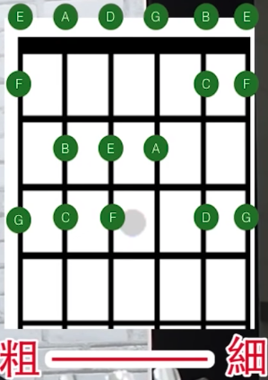

## 基础知识 <!--{docsify-ignore}-->

整理来自：[全新改版：吉他初學從零開始](https://www.youtube.com/watch?v=zk3LD-zJAoM&list=PLjFaYTmhljyCxGict-k8fJ-NZrNbMy_Ro&index=1)

### 音名唱名


```
1	2	3	4	5	6	7		1
C	D	E	F	G	A	B		C
Do	Re	Mi	Fa	Sol	La	Xi(Ti)	Do


1-全音-2-全音-3-半音-4-全音-5-全音-6-全音-7-半音-1

C-全音-D-全音-E-半音-F-全音-G-全音-A-全音-B-半音-C

Do-全音-Re-全音-Mi-半音-Fa-全音-Sol-全音-La-全音-Xi(Ti)-半音-Do


3-半音-4		7-半音-1

Mi-半音-Fa	Xi(Ti)-半音-Do
```

吉他板子上，全音相隔两品，半音相隔一品


中间音的读法？

例如：C - 全音 - D  中间隔了一个品，这个品的音，该怎么读？

可以表示为 #C   或者   降D

读法：  
1、上升音，例如 ：
* #C	就是 Do 去掉尾巴，加上 i ，变成了 Di 
* #G	就是 Sol 去掉尾巴，加上 i，变成了 Si

2、下降音，例如：
* Eb 就是 Mi 去掉维保，加上 e，变成 Me
* Gb 就是  Sol 去掉尾巴，加上 e，变成 Se

特殊情况，Db = Re 去掉尾巴加 e，还是 Re，特殊处理为 Ra


> 升加 # / 降加 b


### 音阶




练习《小蜜蜂》
```
G	E	E	F	D	D	
5	3	3	4	2	2
Sol	Mi	Mi	Fa	Re	Re

C	D	E	F	G	G	G
1	2	3	4	5	5	5
Do	Re	Mi	Fa	Sol	Sol	Sol

G	E	E	F	D	D	
5	3	3	4	2	2
Sol	Mi	Mi	Fa	Re	Re


1	3	5	5	3
Do  Mi  Sol Sol Mi

2   2   2   2   2   3   4
Re  Re  Re  Re  Re  Mi  Fa

3   3   3   3   3   4   5
Mi  Mi  Mi  Mi  Mi  Fa  Sol

G	E	E	F	D	D	
5	3	3	4	2	2
Sol	Mi	Mi	Fa	Re	Re

1   3   5   5   1
Do  Mi  Sol Sol Do
```

### 和弦
```
C   G   Am  Em  F   C   Dm7 G
```
这是卡农的排列组合，很多歌都是用的这个


### 节奏


* 一个箭头：代表一拍，（哒）
* 两个箭头一个下划线：正拍（哒） + 反拍（哒）
* 四个箭头两个下划线：正拍（哒哒） + 反拍（哒哒）
* 一个箭头一个下划线+两个箭头两个下划线：正拍（哒） + 反拍（哒哒）
* 两个箭头两个下划线+一个箭头一个下划线：正拍（哒哒） + 反拍（哒）

拍（哒）

正拍/反拍


### 常用刷法

#### 八个 下<!--{docsify-ignore}-->


#### 下	下 下上	下	下	下	下<!--{docsify-ignore}-->


#### 下	下 下上	下上 下	下 下上<!--{docsify-ignore}-->


#### 下	下 空上 下上 下 下 下上<!--{docsify-ignore}-->


#### 音阶练习 <!--{docsify-ignore}-->

Do | Re | Mi | Fa | Sol | La | Xi(Ti) | Do
:- | :- | :- | :- | :- | :- | :- | :- 
1 | 2 | 3 | 4 | 5 | 6 | 7 | 1
C | D | E | F | G | A | B | C

