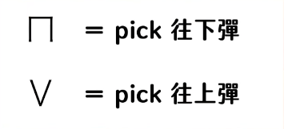
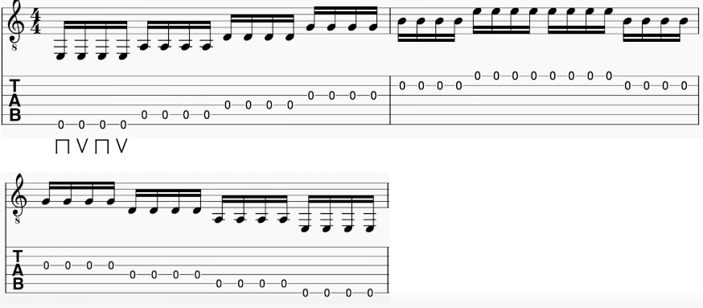
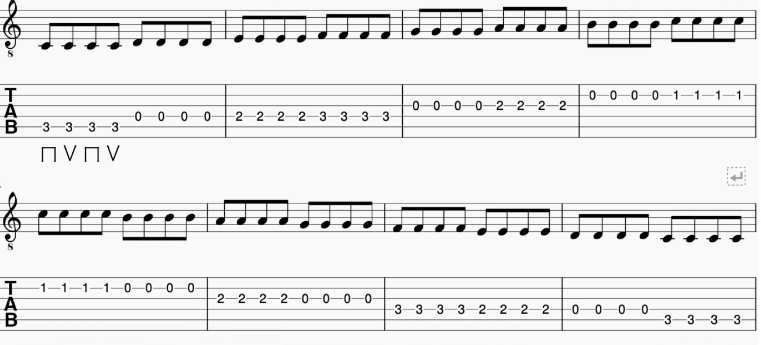
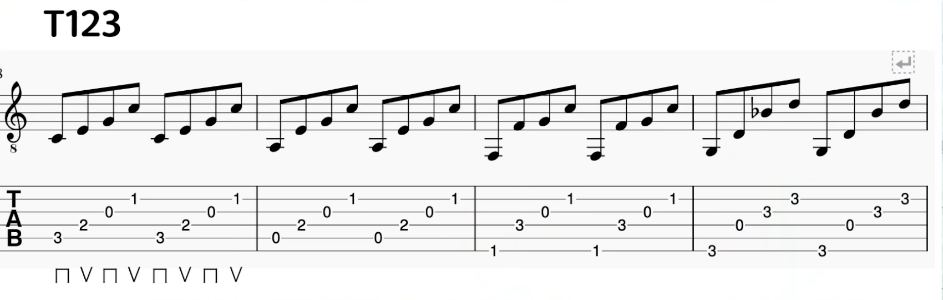
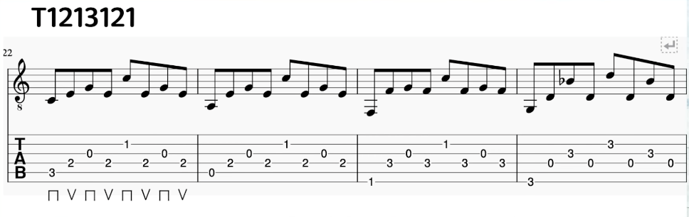
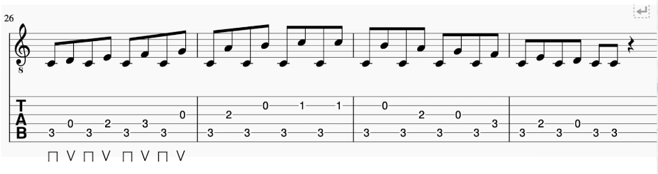
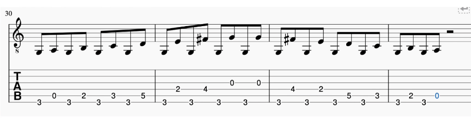
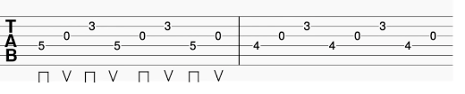

### 拨片练习 <!--{docsify-ignore}-->

信息来源：[Pick彈奏|90%彈吉他的人都不知道的pick技巧|Wen吉他誌](https://www.youtube.com/watch?v=SL7hWf7NuWY)

#### 拨片拿法

比心指法，拨弦的尖尖朝食指指尖方向

#### 拨片选用

刚开始练习使用厚一点的，最好在 1.2mm ~ 2.0mm 之间的厚度

!> 注意：木吉他更适合薄一点的拨片，但是练习推荐使用厚的拨片来练习。

#### 拨片练习

拨弦的时候，使用交替拨弦，即一上一下的拨弦，上下上下的拨弦

<!-- tabs:start -->

<!-- tab:练习一：熟悉弦的位置 -->

**第一阶段**

从上到下，做交替拨弦练习。

从 6 弦开始往 1 弦做交替拨弦，每根弦交替拨弦 8 次。

**第二阶段**

从上到下，再从下到上反复做交替拨弦练习。

从 6 弦开始往 1 弦做交替拨弦，每根弦交替拨弦 4 次；

然后，从 1 弦开始往 6 弦做交替拨弦，每根弦交替拨弦 4 次。

<!-- tab:练习二：结合音阶练习 -->

<!-- panels:start -->
<!-- div:left-panel -->

结合音阶练习，do re mi fa sol la ti -> ti la sol fa mi re do

也是交替拨弦，每根弦交替拨弦 4 次。

<!-- div:right-panel -->

<!-- panels:end -->

<!-- tab:练习三：分散和弦练习 -->

**C 和弦 或 G 和弦 + 指法，做交替拨弦练习**

> 刚开始练习的时候速度放慢一些，熟练了在逐步放快

**跨弦练习**

C 调上的练习

G 调上的练习 

<!-- tab:练习四：复杂练习 -->

<!-- tabs:end -->