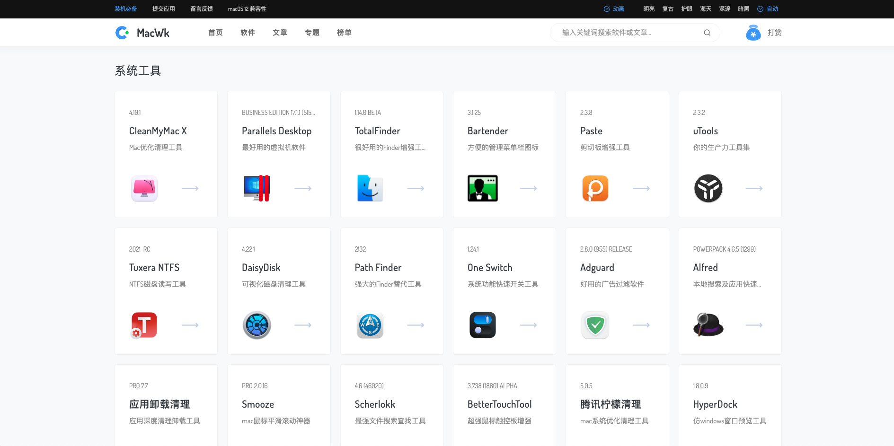

### Mac 下载软件

mac 下载软件有三种渠道：
* appstore
* 软件官网
* 第三方平台

#### appstore
系统自带应用商店，无需多说。

#### 软件官网
一般软件开放商都会在自己官网放置下载连接，用户可以在软件官网下载。
例如：
* vscode https://code.visualstudio.com/Download
* 腾讯柠檬 https://lemon.qq.com/

#### 第三方平台
第三方平台有很多，这里推荐 https://macwk.com/

### 常用软件推荐

* 系统清理：腾讯柠檬 https://lemon.qq.com/
* 压缩工具：BetterZip https://macwk.com/soft/betterzip

