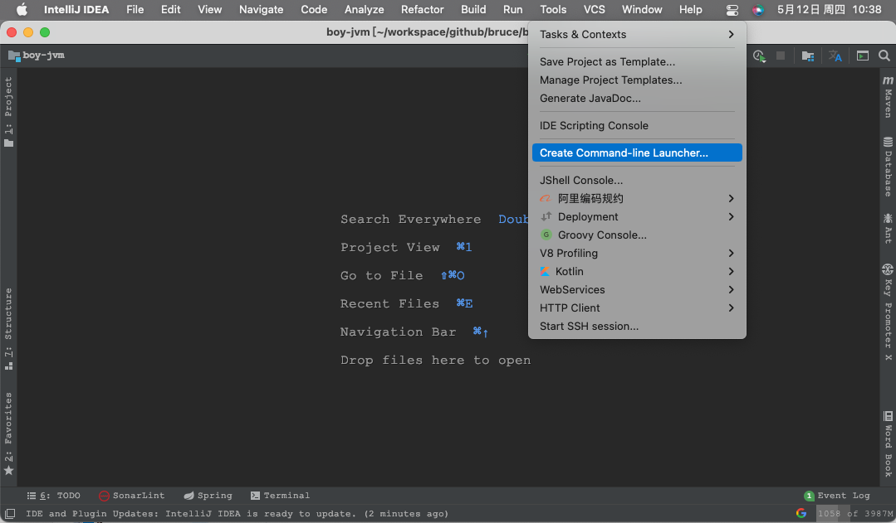
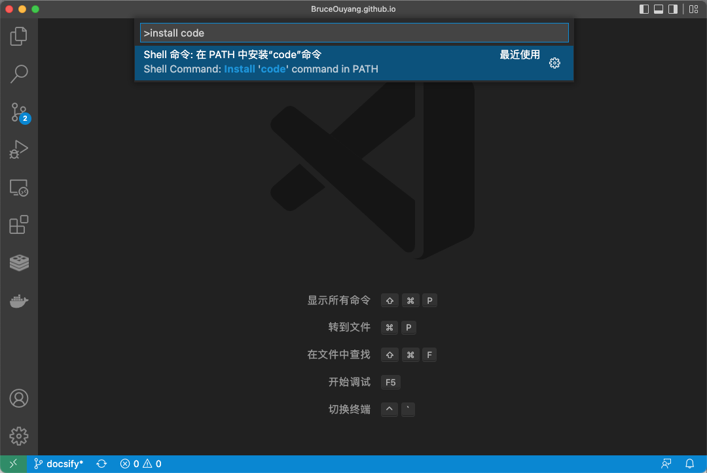

## mac 使用小技巧 <!-- {docsify-ignore} -->

### 1、用命令行打开开发工具
前后开发都避免不了使用命令行来操作，那么用命令打开开发工具一定会是一个很酷的事，:smile:。

#### IntellJ 系列
以 `idea` 为例

1、打开 idea；

2、添加 `idea` 为系统命令
```
顶部 Tools > Create command-line luancher
```



3、打开终端，验证
```bash
# idea [project_path]
idea ~/workspace/project1
```
> 此方法可用于 IntelliJ 所有套件(idea/webstorm/datagrip/goland...)

#### VSCode
1、打开 vscode；

2、添加 `code` 为系统指令，打开命令面板，输入 `install code`，然后回车
> 打开命令面板的快捷键 cmd + shift + p



3、打开终端，验证
```bash
# code [project_path]
code ~/workspace/project1
```

### 2、Finder 相关
#### 显示默认隐藏的文件夹
重复按可切换显示和隐藏
```
shift + command + .
```

#### 快速进入 home 目录
```
shift + command + h
```

#### 显示文件路径
重复按可切换显示和隐藏
```
option + command + p
```

### 3、系统截图方法
#### mac 系统默认截图
> 系统偏好设置 - 键盘 - 快捷键 - 截屏

1 全屏截屏
```
# 截屏存储为文件
shift⇧ + command⌘ + 3

# 截屏到剪贴板
shift⇧ + control⌃ + command⌘ + 3
```

2 区域截屏
```
# 截屏存储为文件
shift⇧ + command⌘ + 4

# 截屏到剪贴板
shift⇧ + control⌃ + command⌘ + 4
```

3 触控栏截屏
```
# 截屏存储为文件
shift⇧ + command⌘ + 6

# 截屏到剪贴板
shift⇧ + control⌃ + command⌘ + 6
```

4 截屏和录制选项
```
shift⇧ + command⌘ + 5
```

#### mac + chrome 网页完整截图
1、打开 chrome，输入目标网页地址

2、按快捷键 `option⌥ + command⌘ + i`

3、按快捷键 `shift⇧ + command⌘ + p`

4、输入 `capture full` 后，按回车

### 4、重置应用软件方法（以 atom 为例）

1、退出 atom

2、在程序坞中，找到并打开 finder

3、在 finder 中，进入用户主目录（按快捷键 `command + shift + h`）

4、在 finder 中，显示隐藏目录（按快捷键 `command + shift + .`）

5、在 finder 中，删除应用配置目录，atom 的配置目录是 `.atom`，直接移除到废纸篓

6、重新打开 atom（按快捷键 `command + 空格` 打开聚焦，输入 atom，然后回车即可），此时 atom 已经恢复原始配置了

### 5、下载软件

mac 下载软件有三种渠道：
* appstore
* 软件官网
* 第三方平台

#### appstore
系统自带应用商店，无需多说。

#### 软件官网
一般软件开放商都会在自己官网放置下载连接，用户可以在软件官网下载。
例如：
* vscode https://code.visualstudio.com/Download
* 腾讯柠檬 https://lemon.qq.com/

#### 第三方平台
第三方平台有很多，这里推荐 https://macwk.com/


#### 常用软件推荐

* 系统清理：腾讯柠檬 https://lemon.qq.com/
* 压缩工具：BetterZip https://macwk.com/soft/betterzip
* 更多其他软件，可以在 macwk 上面查找
  

### 6、关闭 Microsoft 自动更新
方法一：设置更新程序无权访问
```
cd /Library/Application\ Support/Microsoft/MAU2.0/
sudo chmod 000 Microsoft\ AutoUpdate.app
```

方法二：直接删除掉更新程序
```
cd /Library/Application\ Support/Microsoft/MAU2.0/
sudo rm -rf Microsoft\ AutoUpdate.app
```

### 最后 <!--{docsify-ignore}-->
如果你喜欢老欧整理的文章，欢迎你关注我的微信公众号，老欧的issueList站点文章更新时，会同步推送到微信公众号。

