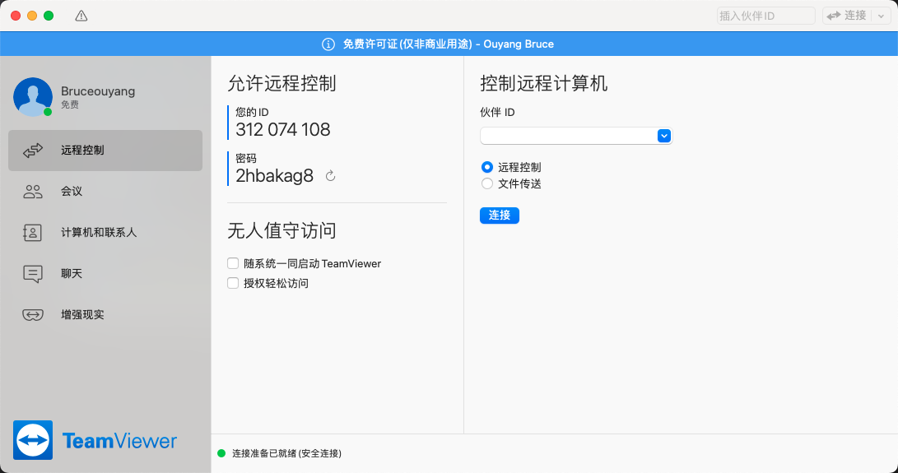

## mac 远程连接 Windows 桌面 <!--{docsify-ignore}-->

远程连接有两种方法：
* 第一种是利用 windows 远程桌面服务连接  
* 第二种是使用 teamviewer 工具连接

### 利用 windows 远程桌面服务连接

前提：  
1、远程 windows 开启远程桌面服务。  
2、mac 上有远程连接工具。  
3、连接双方网络通畅

#### 1、下载工具
微软官方提供的远程连接工具 [remote-desktop-mac](https://docs.microsoft.com/en-us/windows-server/remote/remote-desktop-services/clients/remote-desktop-mac)

#### 2、安装工具
双击安装包即可安装，安装好之后直接运行

#### 3、使用工具
* 3.1、添加一台 pc，点击 add pc 按钮  

* 3.2 输入目标 pc 的 ip 地址，以及别名  

* 3.3 保存后，即可在 PCs 界面看到一台 pc 了  

* 3.4 双击进行连接，输入用户名/密码，然后点 continue 按钮即可，弹出来的提示也继续点 continue  

* 3.5 成功连接，看到 windows 系统的登录页面，并自动登录  
  

这样就可以连接我们的 windows 服务器啦，是不是很简单，赶紧试试吧。

### 使用 teamviewer 连接

前提：  
1、连接双方都需要下载并安装 teamviewer 软件，并运行。  
2、连接双方网络通畅。

#### 1、下载工具
官方下载地址 https://www.teamviewer.cn/cn/download/mac-os/

#### 2、安装工具
双击安装即可。

#### 3、使用工具
* 3.1、安装好之后，直接运行  
  

* 3.2、在伙伴的id那里输入需要远程 windows 的 teamviewer id，然后点击连接

* 3.3、输入密码（远程 windows 的 teamviewer 密码），确定即可完成连接

> 若 teamview 提示需要登录的话，需要先注册一个 teamviewer 账号，然后完成 teamviewer 登录后，再进行远程桌面连接的操作。

