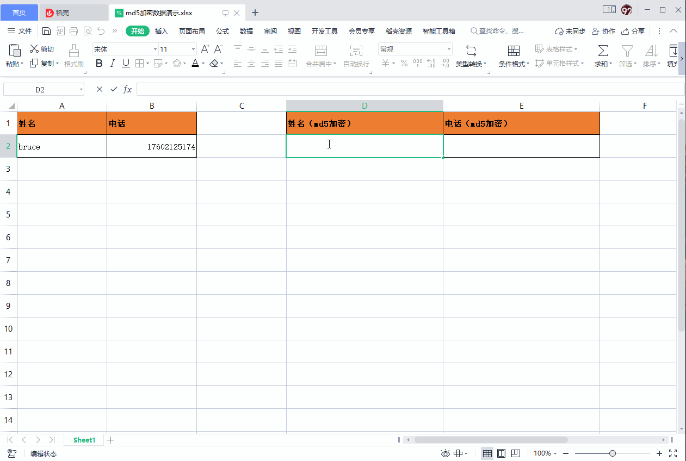
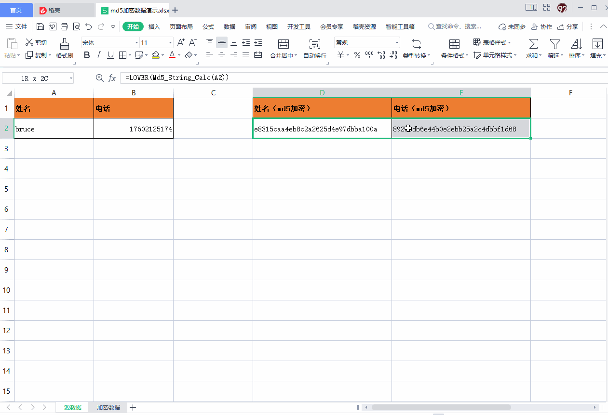

## md5 加密 excel 表格数据 <!--docsify-ignore-->

### 一、准备工具
1、电脑安装：excel 或 wps 表格。

2、下载工具 md5宏.xla 到电脑上备用，下载地址：https://dongs-mall.oss-cn-shanghai.aliyuncs.com/tools/md5.xla

### 二、将下载的 md5宏.xla 加载到 excel 表格或 wps 表格
1、打开 excel 表格或 wps 表格

2、在顶部菜单栏中，找到并点击 【开发工具】/ 【加载项】，会弹出一个框框

3、在【加载项】弹框中，点击【浏览(B)...】，然后弹出一个【浏览框】，在【浏览框】里选择下载好的 md5宏.xla 文件，然后点【打开(O)】

4、在【加载项】弹框中，勾选【Md5宏】，然后点击【确认】


### 三、对表格数据做 md5 加密操作
1、使用如下公式对数据加密：
```
LOWER(Md5_String_Calc(A2))
```
> 注意：公式中的 A2 为需要加密的数据坐标



2、将加密后的数据，仅复制文本到一个新的文件（需要发送给其他人的文件）



#### 四、其他
1、注意事项：

加密操作完成之后，需要在 【开发工具】/ 【加载项】中去掉 md5宏 的勾选，否则每次打开都会弹出一个小框框。

2、示例文件：

[md5加密数据演示.xlsx](https://bruce.bugmakers.club/assets/file/md5加密数据演示.xlsx)