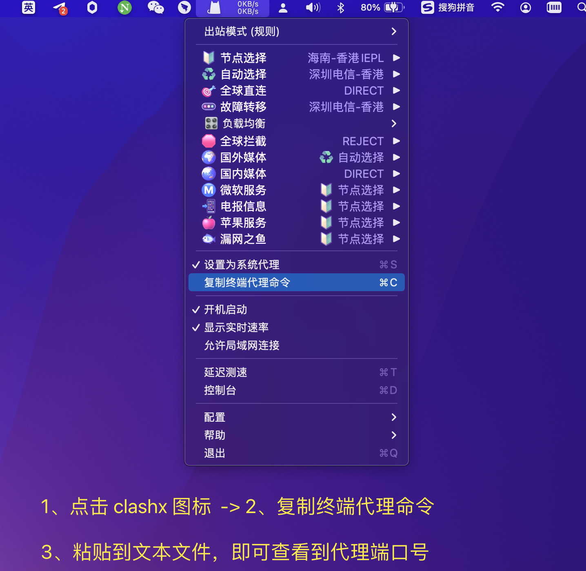

## 网络代理 & Github 加速 & npm 加速 <!-- {docsify-ignore} -->

#### 为什么要用代理
* 为查阅一些资料，很多技术论坛，开源站点都是外网的，需要代理才能访问。
* github 有的时候非常慢，pull / push 很容易卡着，让人极其难受。
* npm install 拉依赖的时候非常慢，这种情况也是网络的原因，需要网络代理来优化。
* ... 

#### 我在用的代理

我在用的网络代理工具是 `ovocloud`，一款付费的代理工具，用了几年了算老用户了，你可以按流量或按时间选择不同的订阅。

基本上各个终端设备都支持，支持设备：windows / linux / mac / ios / android.   

使用不复杂，而且有详细的文档说明，价格也不贵，线路多且快。

我自己订阅的是 10 元每月的，我直接包年订阅，108 元一年。 <br/>


#### 注册`ovocloud`账号

如果你感兴趣，可以用我的推荐链接来注册，[老欧的推荐链接](https://ovocloud.cc/#/register?code=E2SEcZj2)。

#### 按需订阅

`ovocloud` 订阅价格具体参见官网截图： <br/>


推荐按照自己的需求量来选择不同的订阅，如果用量小，可以考虑订阅固定流量，如果每个月经常刷视频，可以选择按月订阅。  


#### 下载和使用工具

这块主要是参考官方使用文档来操作。

工具我推荐 `clash`，它有各个端的对应版本。

> 我基本都使用过，你若遇到工具安装问题，可以在文章底部留言，或关注我的公众号给我留言。  
> 


#### 解决实际性的问题

##### 0、找到代理端口
clash 端口默认是 7890。

确认 clash 代理的端口：


复制出来的文本如下
```bash
export https_proxy=http://127.0.0.1:7890 http_proxy=http://127.0.0.1:7890 all_proxy=socks5://127.0.0.1:7890
```

可以看到，http / https / socks5 代理的端口号都是 7890.

##### 1、github 设置网络代理，加速 github

- http 和 https 协议的 git 代理，打开终端，在任意目录下执行如下命令（按需选择一种即可）

第一种：设置所有 git 操作都走 clash 代理
```bash
// 添加代理
git config --global http.proxy socks5://127.0.0.1:7890
git config --global https.proxy socks5://127.0.0.1:7890

// 取消代理
git config --global --unset http.proxy
git config --global --unset https.proxy
```

第二种：仅 github.com 走 clash 代理，因为可能有的朋友公司内网的 git 仓库无需走代理
```bash
// 添加代理
git config --global http.https://github.com.proxy socks5://127.0.0.1:7890
git config --global https.https://github.com.proxy socks5://127.0.0.1:7890

// 取消代理
git config --global --unset http.https://github.com.proxy
git config --global --unset https.https://github.com.proxy
```

> 可使用 `git config -l` 命令查看 git 的所有配置信息

- ssh 协议的 git 代理

使用 vim 编辑 `~/.ssh/config`，在文件最后添加配置
```bash
//socks5
Host github.com
User git
ProxyCommand connect -S 127.0.0.1:7890 %h %p

//http || https
Host github.com
User git
ProxyCommand connect -H 127.0.0.1:7890 %h %p
```

使配置生效
```bash
source ~/.ssh/config
```

要取消代理的话，只需要删除对应配置，然后执行 `source ~/.ssh/config`即可。


##### 2、npm 设置网络代理，加速 npm
```bash
// 设置代理
npm config set proxy=http://127.0.0.1:7890

// 删除代理
npm config delete proxy
```


至此，你的 git pull / git push / npm install 再也不会卡着一动不动的了，赶快快试试吧 


### 最后 <!--{docsify-ignore}-->
如果你喜欢老欧整理的文章，欢迎你关注我的微信公众号，老欧的issueList站点文章更新时，会同步推送到微信公众号。

